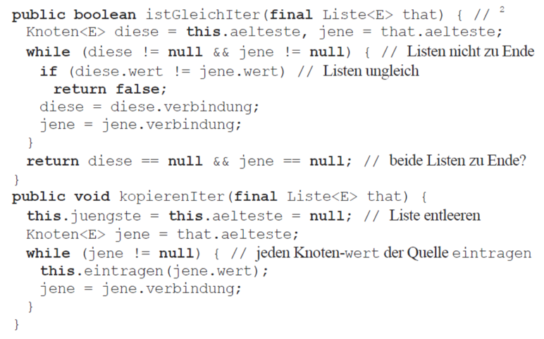
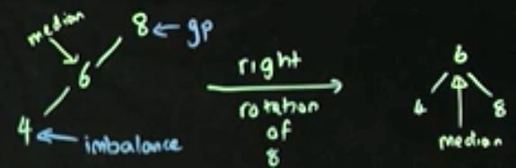
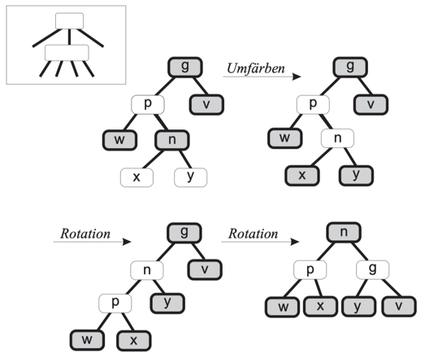
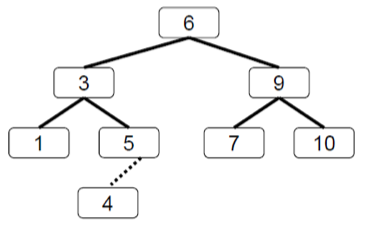
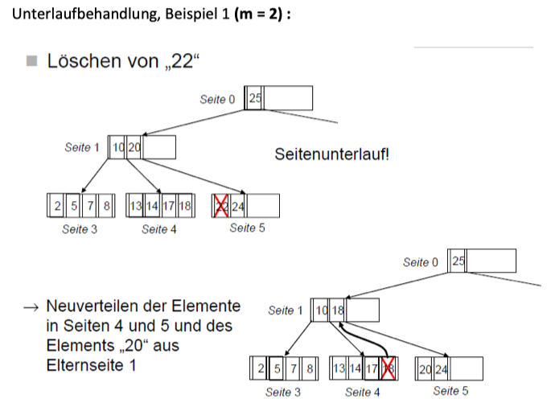

# D&A, Datenstrukturen und Algorithmen, INF-P-SE003, BE1, HS20/21

- [D&A, Datenstrukturen und Algorithmen, INF-P-SE003, BE1, HS20/21](#d-a--datenstrukturen-und-algorithmen--inf-p-se003--be1--hs20-21)
- [1 Grundlagen](#1-grundlagen)
      - [Lernziele](#lernziele)
      - [Vorbereitung](#vorbereitung)
      - [Präsenz](#pr-senz)
  * [Applikative Algorithmen](#applikative-algorithmen)
  * [Imperative Algorithmen](#imperative-algorithmen)
  * [Deduktive Algorithmen](#deduktive-algorithmen)
      - [Nachbearbeitung](#nachbearbeitung)
          + [Implementierungsaufgabe zu Permutationen](#implementierungsaufgabe-zu-permutationen)
- [2 Such- und Sortierverfahren, Registermaschinen](#2-such--und-sortierverfahren--registermaschinen)
      - [Lernziele](#lernziele-1)
      - [Vorbereitung](#vorbereitung-1)
  * [Suche in sortierten Folgen:](#suche-in-sortierten-folgen-)
    + [Sequentielle Suche](#sequentielle-suche)
    + [Binäre Suche (Iterativ)](#bin-re-suche--iterativ-)
  * [Sortieren](#sortieren)
  * [Interne Verfahren:](#interne-verfahren-)
    + [InsertSort](#insertsort)
    + [SelectSort](#selectsort)
    + [BubbleSort](#bubblesort)
  * [Externe Verfahren:](#externe-verfahren-)
    + [MergeSort](#mergesort)
    + [QuickSort](#quicksort)
    + [Vergleich Stabilität und Komplexität Sortierverfahren](#vergleich-stabilit-t-und-komplexit-t-sortierverfahren)
        * [Aufgaben](#aufgaben)
        * [remasp](#remasp)
      - [Präsenz](#pr-senz-1)
  * [Komplexität](#komplexit-t)
    + [Analyse von Algorithmen](#analyse-von-algorithmen)
    + [Bewertungskriterien von Algorithmen](#bewertungskriterien-von-algorithmen)
    + [Stabilität](#stabilit-t)
      - [Nachbearbeitung](#nachbearbeitung-1)
- [3 Berechenbarkeit, Komplexität und Entwurfsprinzipien](#3-berechenbarkeit--komplexit-t-und-entwurfsprinzipien)
      - [Lernziele](#lernziele-2)
      - [Präsenz](#pr-senz-2)
  * [Berechenbarkeit und Entscheidbarkeit](#berechenbarkeit-und-entscheidbarkeit)
  * [Korrektheit und Terminierung](#korrektheit-und-terminierung)
    + [Applikative Algorithmen](#applikative-algorithmen-1)
      - [Algorithmenmuster](#algorithmenmuster)
        * [Brute force](#brute-force)
        * [Greedy](#greedy)
        * [Rekursion](#rekursion)
        * [Rekursion - Devide-and-conquer](#rekursion---devide-and-conquer)
          + [Rekursion - Backtracking](#rekursion---backtracking)
          + [Dynamische Programmierung](#dynamische-programmierung)
      - [Nachbearbeitung](#nachbearbeitung-2)
  * [4 Listen und Hashing](#4-listen-und-hashing)
      - [Lernziele](#lernziele-3)
      - [Vorbereitung](#vorbereitung-2)
      - [Präsenz](#pr-senz-3)
      - [Nachbearbeitung](#nachbearbeitung-3)
  * [5 Bäume](#5-b-ume)
      - [Lernziele](#lernziele-4)
      - [Vorbereitung](#vorbereitung-3)
      - [Präsenz](#pr-senz-4)
      - [Nachbearbeitung](#nachbearbeitung-4)
        * [Merken für die Prüfung:](#merken-f-r-die-pr-fung-)

---
# 1 Grundlagen

#### Lernziele

- Ich verstehe den Begriff des Algorithmus
- Ich kenne verschiedene Arten für die Darstellung von Algorithmen
- Ich kann reguläre Ausdrücke und kontextfreie Grammatiken in Backus-Naur-Form interpetieren und erstellen
- Ich kann rekursive Algorithmen erstellen
- Ich kenne die wichtigsten Programmierparadigmen, insbesondere
 - das applikative,
 - das funktionale und
 - das objektorientierte Paradigma.

#### Vorbereitung

- Lesen Sie Kapitel 1 bis 3 (ohne 3.5) und aus dem Lehrbuch von Saake und Sattler.

#### Präsenz

###Intuitiver Algorithmus-Begriff 
  
Ein Algorithmus ist eine präzise (in einer festegelten Sprache abgefasste) endliche Beschreibung eines allgemeinen Verfahrens unter Verwendung ausführbarer elementarer Verbindungs-Schritten.

- Terminierung
    - Mit Terminierung ist hier ein Ende des Ablaufs aufgrund der Prozedur-Logik gemeint
    
- Determinismus
    - Ein Algorithmus ist deterministisch, wenn in seinem Ablauf keine Zufälligkeit zugelassen ist.
        - Das heisst: für eine vorgegebene Eingabe ist die Schrittfolge samt ihren Zwischenergebnissen eindeutig bestimmt.
    - Ein Algorithmus ist determiniert, wenn er aus einer vorgegebenen Eingabe ein eindeutig bestimmtes Endresultat ermittelt
    
- Rekursion
    - Das Thema ist vom OOP-Kurs bekannt: eine Methode ist rekursiv, wenn sie sich selber aufruft.
    - Die Rekursuion bedeutet die Anwendung dessselben Prinzips auf kleinere oder einfachere Teilprobleme, bis diese Teilprobleme so klein sind, dass sie direkt gelöst werden können.
     
Iterativ:

    public int fakultätIterativ (int n) {
        int f = 1;
        for (int i = 2; i <= n; i++) {
            f = f * 1
        }
    }

Rekursiv:

    public int fakultätRekursiv (int n) {
        if (n < 2) {
            return 1;
        }
        else {
            return fakultätRekursiv(n-1) * n;
        }
    }

###Bausteine eines Algorithmus

- elementare Operationen
    - Schritte, die mit je einem kurzen Satz ohne weitere Detailierung beschrieben werden können (=> “Multipliziere x mit 3”)
- sequenzielle Ausführung (ein Prozessor!)
- paralelle Ausführung (mehrere Prozessoren!)
- bedingte Ausführung (if than else)
- Schleife (while)
- Unterprogramm
- Rekursion: Anwendung des selben Prinzips auf kleine Teilprobleme

Die übrigen Bausteine werden mit Vorteil als Pseudocode-Konstrukte dargestellt. Diese Notation benutzt einige allgemein bekannte Elemente von verbreiteten Programmiersprachen in Kombination mit “Prosa”-Ergänzungen, wobei die technischen Regel des ausführbaren Code’s ignoriert werden können.

###Sprachen und Grammatiken

- Die Zusammenfassung von Syntaxregeln einer beliebigen Sprache wird als ihre Grammatik bezeichnet.
- Zusätzlich zu den syntaktischen Einschränkungen müssen die Sätze einer Sprache auch semantisch korrekt sein, d.h. eine plausible Bedeutung haben.

- Syntax: Formale Regeln, welche Sätze gebildet werden können:
    
        "Der Elefant ass die Erdnuss." (syntaktisch korrekt)
        "Der Elefant ass Erdnuss die." (syntaktisch falsch)
  
- Semantik: (Formale) Regeln, welche Sätze eine Bedeutung haben:
    
        "Der Elefant ass die Erdnuss." (semantisch korrekt "sinnhaft)
        "Die Erdnuss ass den Elefanten." (semantisch falsch "sinnlos")
    
- Die Korrektheit des Verfahrens ist nicht auf den ersten Blick ersichtlich. Ein Leitfaden für den Nachweis: die Menge von gemeinsamen Teilern bleibt bei jedem Schritt unverändert.
- Typisches Merkmal eines Algorithmus: das eigentliche Ziel wird im Verfahren nicht erwähnt. Das ist häufig der Fall, es muss oft ein Schema "blind befolgt" werden 
    - (Beispiel: aus einem Labyrinth kann immer der Ausweg gefunden werden, indem die Wand mit einer Hand berührt wird).

###Reguläre Ausdrücke (Regular Expressions oder Regex) 

ist ein anderer Formalismus, mit dem einfachere, i.d.R. nicht-rekursive Grammatiken definiert werden können. Es wird standardmässig verwendet zur Erkennung/Suche von Textmustern. Eine vereinfachte Form benutzt die folgenden Konventionen:

- "Worte" sind die nicht weiter zerlegbaren Satzbestandteile, in unseren Beispielen etwa a,b,c, etc...
- Die Sequenz beschreibt das "Hintereinanderschreiben": pq
- Die Auswahl ermöglicht die Wahlzwischen zwei Alternativen: p + q
- Die Iteration ermöglicht das Wideerholen von Sequenzbausteinen: p*
    - (0-,1- oder n-mal)
    - Eine oft genutzte Variante der Iteration schliesst die "leere" Iteration aus: p^+ (1- oder n-mal)
- Zusätzlich besteht die Möglichkeit der Klammerung zur Strukturierung. Ansonsten gilt "Punkt- vor Strichrechnung"

Die effektiven Regex-Implementierungen in verschiedenen Sprachen und Umgebungen bieten viel mehr Möglichkeiten, sie unterscheiden sich aber voneinander in Details und sind meistens unzureichend dokumentiert.

- ggT
    - Euklid-Algorithmus in Java
    - Iterative Variante:
    
    
    
    - Rekursive Variante:
    
    
    
    - Beschleunigte Variante:
    
    
    
    - Eine „gerade aus“ – Variante führt zum gleichen Ziel:

        static int ggtEinfach(int ersteZahl, int zweiteZahl) {
            // requires ersteZahl > 0 && zweiteZahl > 0; ensures return > 0 
            for (int i = Math.min(ersteZahl, zweiteZahl); i > 0; i--)
                if ((ersteZahl % i == 0) && (zweiteZahl % i == 0))
                    return i; 
            return 0; // wenn requires nicht erfüllt
        }

##Datentypen und Terme

bool

integer

Zeichenketten:

char/string

Felder:

array

Terme:

Terme sind arithmetische und Boole’sche Ausdrücke, die gemäss den üblichen mathematischen Regeln ausgewertet werden.

Bedingte Terme:

if

## Applikative Algorithmen
Für die Implementierung dieser Art von Algorithmen eignen sich besonders sog. funktionale Sprachen (Haskell, APL, Lisp, Scheme).

- Die wichtigsten Merkmale:
    - Input => Formel => Output
    - Keine Schleifen, sondern Rekursion
    - Keine Zwischenspeicherung
        
Die Umwandlung von Input zu Output erfolgt mittels einer Funktion. Diese entspricht in etwa einer Java-Klassenmethode (static) mit einem Rückgabewert (Output) und einer Parameterliste (Input). In unserem Kontext werden Funktionen als Terme mit Unbestimmten (Symbole ohne festen Wert) definiert. (Man nennt sie auch zusammengesetzte Funktionen, weil die Terme Aufrufe von anderen Funktionen beinhalten können.)

Ein applikativer Algorithmus ist eine Menge von Funktionsdefinitionen:

Die erste Funktion f1 wird wie beschrieben ausgewertet und ist die Bedeutung (Semantik) des Algorithmus.

## Imperative Algorithmen
- Die am meisten verbreiteten Sprachen (C, Java, Pascal, Delphi, Cobol) zielen auf diesen Algorithmus-Stil ab (wobei z.B. Java und C-Sharp auch funktionale Elemente integrieren).

- Die wichtigsten Merkmale:
    - Eine Abfolge von Schritten ( = Zustandsänderungen )
    - Schleifen
    - Zwischenspeicherung
- Damit unterscheiden sich die imperativen Algorithmen von den applikativen.

Die Algorithmenausführung imperativer Algorithmen besteht aus einer Folge von Basisschritten, genauer von Wertzuweisungen. Diese Folgen basierend auf booleschen Tests über dem Zustand konstruiert. Jeder Basisschritt definiert eine elementare Transformation des Zustands. Die Semantik des Algorithmus ist durch die Kombination all dieser Zustandstransformationen zu einer Gesamttransformation festgelegt.

## Deduktive Algorithmen
- Keine unmittelbar einsetzbare Algorithmen, sondern übergeordnete Regelwerke, welche aus Regeln und Fakten bestehen und für eine konkrete Anfrage einen algorithmischen Pfad zur Antwort ableiten können (Deduktion).

#### Nachbearbeitung

- [RegEx](http://regextutorials.com/)
    - [RegEx-Editor](https://regex101.com)
- [Grammatik](https://moodle.ffhs.ch/mod/assign/view.php?id=3644647)
    - [Beispiel 1](http://www.cs.utsa.edu/~wagner/CS3723/grammar/examples2.html)
    - [Beispiel 2](http://www.cs.utsa.edu/~wagner/CS3723/grammar/examples.html)
    - [BNR-Wikipwdia](https://en.wikipedia.org/wiki/Backus–Naur_form)
- [Permutation](https://moodle.ffhs.ch/mod/assign/view.php?id=3644648)

Grammatik Aufgabe:

###Backus-Naur-Form (BNF)

    1a)/b)
    
    <operand>         ::= x | y | z | <klammerausdruck>
    <operantor>       ::= + | -
    <ausdruck>        ::= <operand> <operator> <ausdruck> | <operand>
    <klammerausdruck> ::= (<ausdruck>)
        
        
    3
        
    power(m, e) =   if m = 0 && e <= 0 then power(m, e) else    --> Infinite Loop wenn undefinierte Eingabe
                    if e = 0 then 1 else                        --> Wenn der Exponent 0 dann fertig
                    if e > 0 then power(m, e - 1) * m else      --> Nur für positive Exponenten
                    1 / power(m, -e) fi fi fi                   --> Bei negativem Exponenten einmal den Umkehrwert anschliessend wieder Rekursive

###### Implementierungsaufgabe zu Permutationen

- [Permutationen wiki](https://de.wikipedia.org/wiki/Permutation)

- Beispiel Permutationen Aufgaben DuA Gruppe 7

        public class Permutations {
            /**
             * Erzeugt ein Array von allen Permutationen von {0,1,2,3,...,n-1}.
             *
             * @param n Anzahl Elemente in einer Permutation.
             * @return Ein Array von Permutationen; jede Permutation ist ein Array von Integern.
             */
            public static int[][] permutations(int n) {
        
                if (n == 0) {
                    return new int[][]{};
                }
                int[][] perm = permutations(n - 1);
                int fak = 1;
                for (int i = 1; i <= n; i++) {
                    fak *= i;
                }
                int[][] result = new int[fak][n];
                int[] ints = new int[n - 1];
                for (int i = 0; i < n; i++) {
                    for (int j = 0; j < ints.length; j++) {
                        ints[j] = j >= i ? j + 1 : j;
                    }
                    for (int k = 0; k < perm.length; k++) {
                        int[] perm1 = perm[k];
                        int[] perm2 = result[(i * perm.length) + k];
                        for (int l = 0; l < perm1.length; l++) {
                            perm2[1 + l] = ints[perm1[l]];
                        }
                    }
                    for (int j = 0; j < perm.length; j++) {
                        result[i * perm.length + j][0] = i;
                    }
                }
                return result;
            }
        }

---
# 2 Such- und Sortierverfahren, Registermaschinen

#### Lernziele

- Ich kenne das Prinzip der binären Suche.
- Ich verstehe verschiedene Sortieralgorithmen und ihr Performanzverhalten.
- Ich kenne Registermaschinen als abstraktes Berechenbarkeitsmodell.
- Ich weiß, dass es Probleme gibt, die algorithmisch nicht lösbar sind und ich verstehe die Bedeutung der Churchen These.

#### Vorbereitung

## Suche in sortierten Folgen:

### Sequentielle Suche

- Ablauf
    - Durchsucht jeden Eintrag der Reihe nach
    - Nicht praktikabel ausser die Lösung befindet sich direkt am Anfang

- PseudoCode
   

        algorithm SeqSearch (F, k) → p

        Eingabe: Folge F der Länge n, Suchschlüssel k
        Ausgabe: Position p des ersten Elementes aus F, das gleich k ist, sonst NO_KEY
        
        for i := 1 to n do
            if F[i] = k then
                return i
            fi 
        od; 
        return NO_KEY
        
- Aufwand

| |Anzahl Vergleiche|
|---|---|
|bester Fall|1|
|schlechtester Fall|n|
|Durchschnintt (erfolgreiche Suche)|(n+1)/2|
|Durchschnintt (erfolgreiche Suche)|n|

- in Java

        public class SeqSearch { 
            public final static int NO KEY = −1;
        
            static int search(int[] array, int key) {
                for (int i = 0; i < array.length; i++)
                    if (array[i] == key) 
                        return i; 
                return NO KEY;
            }
        
            public static void main(String[] args) {
                if (args.length != 1) { 
                    System.out.println("usage: SeqSearch <key>"); 
                    return; 
                }
            int[] f = { 2, 4, 5, 6, 7, 8, 9, 11 };
            int k = Integer.parseInt(args[0]);
            System.out.println("Sequenziell: " + search(f, k));
                }
        }

### Binäre Suche (Iterativ)

- Ablauf
    1. Wähle den mittleren Eintrag und prüfe, ob gesuchter Wert in der ersten oder in der zweiten Hälfte der Folge ist.
    2. Fahre analog 1. mit der Hälfte fort, in der sich der Eintrag befindet.

- PseudoCode

        algorithm BinarySearch (F, k) → p
        
        Eingabe: Folge F der Länge n, Suchschlüssel k
        Ausgabe: Position p des ersten Elementes aus F, das gleich k ist, sonst NO_KEY
        
        u := 1, o := n;
        while u <= o do
            m := (u + o)/2;
            if F[m] = k then
                return m 
            else if k < F[m] then
                o := m − 1
            else
                u := m + 1
            fi 
        od; 
        return NO_KEY

- Aufwand

| |Anzahl Vergleiche|
|---|---|
|bester Fall|1|
|schlechtester Fall|~log2n|
|Durchschnintt (erfolgreiche Suche)|~log2n|
|Durchschnintt (erfolglose Suche)|~log2n|

- in Java

        public class BinSearch { 
            public final static int NO KEY = −1;
            static int search(int[] array, int key) {
                int u = 0, o = array.length − 1;
                while (u <= o) {
                    int m = (u + o) / 2;
                    if (array[m] == key) 
                        return m; 
                    else if (array[m] > key)
                        o = m − 1;
                    else
                        u = m + 1;
                } 
                return NO KEY;
            }
            
            public static void main(String[] args) {
                if (args.length != 1) { 
                    System.out.println("usage: BinSearch <key>"); 
                    return; 
                }
                int[ ] f = { 2, 4, 5, 6, 7, 8, 9, 11 };
                int k = Integer.parseInt(args[0]);
                System.out.println("Binär: " + search(f, k));
            }
        }
        
- Vergleich des Aufwandes

       

## Sortieren

- Grundbegriffe
  
    - Interne Verfahren
        - Passen auf Speicher
        - Listen
        
    - Externe Verfahren
        - Externe Spechermedien
        - Datenbanken im Giga- oder Terabyte Bereich
      
    - Stabilität
        - Relative Reihenfolge gleicher Schlüssel bliebt gleich
        - z.B. Alphabetische ordnung bleibt erhalten

        

## Interne Verfahren:

- Passen auf Speicher
- Listen

### InsertSort

- Komplexitätsklasse im Durchschnittsfall: O(n^2 )

- Ablauf
    1. Starte mit der ersten Karte einen neuen Stapel.
    
    2. Nimm jeweils die nächste Karte des Originalstapels und füge diese an der richtigen Stelle in den neuen Stapel ein.

- PseudoCode

        algorithm InsertionSort (F) 
        Eingabe: zu sortierende Folge F der Länge n
        
        for i := 2 to n do
            m := F[i]; /* zu merkendes Element */
            j := i;
            while j > 1 do
                if F[j − 1] ≥ m then
                    /* Verschiebe F[j − 1] eine Position nach rechts */
                    F[j] := F[j − 1];
                    j := j − 1
                else 
                    Verlasse innere Schleife 
                fi 
            od; 
            F[j] := m /* j zeigt auf Einfügeposition */ 
        od
        

- in Java

        static void insertionSort(int[] array) {
            for (int i = 1; i < array.length; i++) {
                int j = i;
                int m = array[i];
                // für alle Elemente links vom Marker-Feld 
                while (j > 0 && array[j − 1] > m) { 
                    // verschiebe alle größeren Element nach hinten
                    array[j] = array[j − 1];
                    j−−;
                } 
                // setze m auf das freie Feld
                array[j] = m;
            }
        }
        
- Beispiel Präsenz

    - Diese Methode entspricht dem üblichen Vorgehen beim manuellen Sortieren. Die sortierte Folge wird schrittweise (Schritt = Durchlauf) am linken Rand aufgebaut, der Anfang des unsortierten rechten Teils („Grenzstein“) ist fett markiert.
    - Bei jedem Durchlauf nimmt man zuerst den Grenzstein heraus, dann wandert man damit nach links durch die geordnete Folge bis zur Stelle, die seinem Wert entspricht, wobei übersprungene Elemente höheren Wertes nach rechts geschoben werden. An der gefundenen (leergewordenen) Stelle wird anschliessend das herausgenommene Element eingefügt.

- Beispiel Aufgaben DuA Gruppe 7

        public class InsertSort {
            /**
             * Sortiert ein Array durch Einfügen
             *
             * @param array Das zu sortierende Array.
             */
            public static void sort(int[] array) {
                sort(array, 0, array.length);
            }
        
            /**
             * Sortiert einen durch zwei Grenzen angebenen Teil eines Arrays durch Einfügen.
             * Arrayelemente ausserhalb der Grenzen werden nicht verschoben.
             *
             * @param array Zu sortierende Elemente
             * @param start Index des ersten  Elementes des Teils, das Sortiert werden muss.
             * @param end   Index des letzten Elementes des Teils, das sortiert werden muss.
             */
            public static void sort(int[] array, int start, int end) {
                if (start < 0) {
                    return;
                }
                if (start >= end && end > 0) {
                    return;
                }
                if (end > array.length) {
                    return;
                }
        
                for (int i = start + 1; i < end; i++) {
                    int elementToInsert = array[i];
                    int insertIndex = i;
        
                    while (insertIndex > start && elementToInsert < array[insertIndex - 1]) {
                        array[insertIndex] = array[insertIndex - 1];
                        insertIndex--;
                    }
                    array[insertIndex] = elementToInsert;
                }
            }
        
        }

### SelectSort

- Komplexitätsklasse: O(n^2)

- Ablauf 
    - Die Idee ist hierbei, jeweils das größte Element auszuwählen und an das Ende der Folge zu setzen.

- PseudoCode

        algorithm SelectionSort (F) 
        Eingabe: zu sortierende Folge F der Länge n
        
        p := n;
        while p > 0 do
            g := Index des größten Elementes aus F im Bereich 1. . . p; 
            Vertausche Werte von F[p] und F[g];
            p := p − 1
        od

- in Java

        static void swap(int[] array, int idx1, int idx2) {
            int tmp = array[idx1];
            array[idx1] = array[idx2];
            array[idx2] = tmp;
        }
        
        static void selectionSort(int[] array) { 
            int marker = array.length − 1; 
            while (marker >= 0) { // bestimme größtes Element
                int max = 0;
                for (int i = 1; i <= marker; i++)
                    if (array[i] > array[max])
                    max = i;
                // tausche array[marker] mit diesem Element 
                swap(array, marker, max); 
                marker−−;
            }
        }
        
- Beispiel aus Präsenz

    - Eine einfache, „gerade aus“ - Methode. Die sortierte Folge wird schrittweise (Schritt = Durchlauf) am rechten Rand aufgebaut, der unsortierte linke Teil ist fett markiert.
    - Bei erstem Durchlauf sucht man das Maximum von sämtlichen n Elementen und vertauscht es dann mit der rechten Randstelle. Dann sucht man das Maximum der unsortierten linken (n-1) - Subsequenz und vertauscht es mit der vorletzten Stelle rechts, usw.

- in Java Beispiel aus Algo-Inet:

        public class Selection {
        
            // This class should not be instantiated.
            private Selection() { }
        
            /**
             * Rearranges the array in ascending order, using the natural order.
             * @param a the array to be sorted
             */
            public static void sort(Comparable[] a) {
                int n = a.length;
                for (int i = 0; i < n; i++) {
                    int min = i;
                    for (int j = i+1; j < n; j++) {
                        if (less(a[j], a[min])) min = j;
                    }
                    exch(a, i, min);
                    assert isSorted(a, 0, i);
                }
                assert isSorted(a);
            }
        
            /**
             * Rearranges the array in ascending order, using a comparator.
             * @param a the array
             * @param comparator the comparator specifying the order
             */
            public static void sort(Object[] a, Comparator comparator) {
                int n = a.length;
                for (int i = 0; i < n; i++) {
                    int min = i;
                    for (int j = i+1; j < n; j++) {
                        if (less(comparator, a[j], a[min])) min = j;
                    }
                    exch(a, i, min);
                    assert isSorted(a, comparator, 0, i);
                }
                assert isSorted(a, comparator);
            }
        
        
           /***************************************************************************
            *  Helper sorting functions.
            ***************************************************************************/
            
            // is v < w ?
            private static boolean less(Comparable v, Comparable w) {
                return v.compareTo(w) < 0;
            }
        
            // is v < w ?
            private static boolean less(Comparator comparator, Object v, Object w) {
                return comparator.compare(v, w) < 0;
            }
                
                
            // exchange a[i] and a[j]
            private static void exch(Object[] a, int i, int j) {
                Object swap = a[i];
                a[i] = a[j];
                a[j] = swap;
            }
        
        
           /***************************************************************************
            *  Check if array is sorted - useful for debugging.
            ***************************************************************************/
        
            // is the array a[] sorted?
            private static boolean isSorted(Comparable[] a) {
                return isSorted(a, 0, a.length - 1);
            }
                
            // is the array sorted from a[lo] to a[hi]
            private static boolean isSorted(Comparable[] a, int lo, int hi) {
                for (int i = lo + 1; i <= hi; i++)
                    if (less(a[i], a[i-1])) return false;
                return true;
            }
        
            // is the array a[] sorted?
            private static boolean isSorted(Object[] a, Comparator comparator) {
                return isSorted(a, comparator, 0, a.length - 1);
            }
        
            // is the array sorted from a[lo] to a[hi]
            private static boolean isSorted(Object[] a, Comparator comparator, int lo, int hi) {
                for (int i = lo + 1; i <= hi; i++)
                    if (less(comparator, a[i], a[i-1])) return false;
                return true;
            }
        
        
        
            // print array to standard output
            private static void show(Comparable[] a) {
                for (int i = 0; i < a.length; i++) {
                    StdOut.println(a[i]);
                }
            }
        
            /**
             * Reads in a sequence of strings from standard input; selection sorts them; 
             * and prints them to standard output in ascending order. 
             *
             * @param args the command-line arguments
             */
            public static void main(String[] args) {
                String[] a = StdIn.readAllStrings();
                Selection.sort(a);
                show(a);
            }
        }

### BubbleSort

- Komplexitätsklasse im Durchschnittsfall: O(n^2)

- Ablauf 
    - Das Grundprinzip besteht demzufolge darin, die Folge immer wieder zu durchlaufen und dabei benachbarte Elemente, die nicht der gewünschten Sortierreihenfolge entsprechen, zu vertauschen.

- PseudoCode

        algorithm BubbleSort (F) 
        Eingabe: zu sortierende Folge F der Länge n
        
        do
            for i := 1 to n − 1 do
                if F[i] > F[i + 1] then 
                    Vertausche Werte von F[i] und F[i + 1] 
                fi 
            od 
        until keine Vertauschung mehr aufgetreten

- in Java

        static void bubbleSort(int[] array) { 
            boolean swapped;
            do { 
                swapped = false;
                for (int i = 0; i < array.length − 1; i++) {
                    if (array[i] > array[i + 1]) {
                        // Elemente vertauschen 
                        swap(array, i, i + 1); 
                        swapped = true; 
                    }
                } 
                // solange Vertauschung auftritt 
            } while (swapped);
        }

- Beispiel aus Präsenz

    - Bei jedem Durchlauf iteriert man durch die ganze Folge und vergleicht jedes Element mit seinem Nachfolger. Wenn das Paar nicht die gewünschte (hier aufsteigende) Reihenfolge hat, werden die zwei Elemente miteinander vertauscht. Der Vorgang wird beendet, wenn bei einem Durchlauf keine Vertauschungen stattfinden.

- in Java Beispiel aus Algo-Inet:

    public class Bubble {
    
       // This class should not be instantiated.
        private Bubble() { }
    
        /**
         * Rearranges the array in ascending order, using the natural order.
         * @param a the array to be sorted
         */
        public static <Key extends Comparable<Key>> void sort(Key[] a) {
            int n = a.length;
            for (int i = 0; i < n; i++) {
                int exchanges = 0;
                for (int j = n-1; j > i; j--) {
                    if (less(a[j], a[j-1])) {
                        exch(a, j, j-1);
                        exchanges++;
                    }
                }
                if (exchanges == 0) break;
            }
        }
    
        // is v < w ?
        private static <Key extends Comparable<Key>> boolean less(Key v, Key w) {
            return v.compareTo(w) < 0;
        }
    
        // exchange a[i] and a[j]
        private static <Key extends Comparable<Key>> void exch(Key[] a, int i, int j) {
            Key swap = a[i];
            a[i] = a[j];
            a[j] = swap;
        }
    
       // print array to standard output
        private static void show(Comparable[] a) {
            for (int i = 0; i < a.length; i++) {
                StdOut.println(a[i]);
            }
        }
    
        /**
         * Reads in a sequence of strings from standard input; bubble sorts them;
         * and prints them to standard output in ascending order.
         *
         * @param args the command-line arguments
         */
        public static void main(String[] args) {
            String[] a = StdIn.readAllStrings();
            Bubble.sort(a);
            show(a);
        }
    }

## Externe Verfahren:

- Externe Spechermedien
- Datenbanken im Giga- oder Terabyte Bereich

### MergeSort

- Komplexitätsklasse: O(n * log n)

- Ablauf 
    1. Die Folge wird in Teile zerlegt, die jeweils in den Hauptspeicher passen und daher getrennt voneinander mit internen Verfahren sortiert werden können. Diese sortierten Teilfolgen werden wieder in Dateien ausgelagert.
    
    2. Anschließend werden die Teilfolgen parallel eingelesen und gemischt, indem jeweils das kleinste Element aller Teilfolgen gelesen und in die neue Folge (d.h. wieder in eine Datei) geschrieben wird.
   
 
- PseudoCode

    - Mischen von zwei Folgen:

            procedure Merge (F 1 , F 2 ) → F
            
            Eingabe: zwei zu sortierende Folgen F 1 , F2  
            Ausgabe: eine sortierte Folge F
            
            F := leere Folge; 
            while F 1 und F 2 nicht leer do
                Entferne das kleinere der Anfangselemente aus F 1 bzw. F 2 ;
                Füge dieses Element an F an 
            od; 
            Füge die verbliebene nichtleere Folge F 1 oder F 2 an F an; 
            return F

    - Sortieren durch Mischen:

            algorithm MergeSort (F) → FS 
            
            Eingabe: eine zu sortierende Folge F 
            Ausgabe: eine sortierte Folge FS 
            
            if F einelementig then 
                return F 
            else 
                Teile F in F 1 und F 2 ; 
                F 1 := MergeSort (F 1 ); 
                F 2 := MergeSort (F 2 ); 
                return Merge (F 1 , F 2 ) 
            fi

- in Java

        // Hilfsmethode für rekursives Sortieren durch Mischen 
        static void msort(int[] array, int le, int ri, int[ ] helper) {
            int i, j, k;
            if (ri > le) {
                // zu sortierendes Feld teilen
                int mid = (ri + le) / 2;
                
                // Teilfelder sortieren 
                msort(array, le, mid, helper); 
                msort(array, mid + 1, ri, helper);
                 
                // Hilfsfeld aufbauen
                for (k = le; k <= mid; k++)
                    helper[k] = array[k];
                for (k = mid; k < ri; k++)
                    helper[ri + mid − k] = array[k + 1];
                    
                // Ergebnisse mischen über Hilfsfeld
                i = le; j = ri;
                for (k = le; k <= ri; k++)
                    if (helper[i] < helper[j]) 
                        array[k] = helper[i++];
                    else
                        array[k] = helper[j−−];
            }
        } 
        
        static void mergeSort(int[] array) {
            int helper[] = new int[array.length];
            msort(array, 0, array.length − 1, helper); 
        }

- Beispiel aus Präsenz

    - Dieses Vorgehen kann auch dann verwendet werden, wenn Arbeitsspeicher für die Datenmenge nicht ausreicht ➔ Input wird von externen Medien bezogen.
    - Eine Variante von MergeSort kann auch für Datenfolgen im Arbeitsspeicher sehr effektiv eingesetzt werden. Dabei wird die Folge rekursiv zweigeteilt bis zur Folgenlänge 1 und die Fragmente anschliessend durch Mischung zusammengefügt:
    - Analyse MergeSort (rekursive Variante):
        - Zeitaufwand
            - Unempfindlich auf die Datenbeschaffenheit ➔ n * log n
        
        - Speicherbedarf
            - Zusätzlicher Speicher notwendig für Resultate der Mischung

- Beispiel aus Aufgaben DuA Gruppe 7

        public class MergeSort {
            /**
             * Sortiert ein Array durch Mischen
             *
             * @param array Das zu sortierende Array.
             */
            public static void sort(int[] array) {
                sort(array, 0, array.length - 1);
            }
        
            /**
             * Sortiert einen durch zwei Grenzen angebenen Teil eines Arrays durch Mischen.
             * Arrayelemente ausserhalb der Grenzen werden nicht verschoben.
             *
             * @param array Zu sortierende Elemente
             * @param start Index des ersten  Elementes des Teils, das Sortiert werden muss.
             * @param end   Index des letzten Elementes des Teils, das sortiert werden muss.
             */
            public static void sort(int[] array, int start, int end) {
                if (end - start < 1) return;
                int midpoint = (start + end) / 2;
                sort(array, start, midpoint);
                sort(array, midpoint + 1, end);
                merge(array, start, midpoint, end);
            }
        
            private static void merge(int[] array, int first, int midpoint, int last) {
                // Aufteilen der Arrays
                int leftStart = first;
                int rightStart = midpoint + 1;
        
                int[] temp = new int[last - first + 1];
                int currentTemp = 0;
        
                // Ziehen des kleinsten Werts aus dem jeweiligen Array
                while (midpoint - leftStart >= 0 && last - rightStart >= 0) {
                    temp[currentTemp++] = array[(array[leftStart] > array[rightStart]) ? rightStart++ : leftStart++];
                }
        
                // Wenn Array aufgebraucht, kann der jeweilig andere kopiert werden
                while (midpoint - leftStart >= 0) {
                    temp[currentTemp++] = array[leftStart++];
                }
        
                while (last - rightStart >= 0) {
                    temp[currentTemp++] = array[rightStart++];
                }
        
                // Wiedereinfügen in den ursprünglichen Array
                if (temp.length >= 0) System.arraycopy(temp, 0, array, first, temp.length);
            }
        }

### QuickSort

- Komplexitätsklasse im Durchschnittsfall: O(n * log n)

- Ablauf 

    - Die Grundidee von QuickSort ist die Zerlegung der Folge in zwei Teile, wobei alle Elemente der einen Teilfolge kleiner als ein Referenzelement (das so genannte Pivot-Element) und alle Elemente der anderen Teilfolge größer als das Referenzelement sind.

- PseudoCode

        algorithm QuickSort (F, u, o)
        Eingabe: eine zu sortierende Folge F, die untere und obere Grenze u, o
        
        if o > u then
            Bestimme Position p des Pivot-Elementes; 
            pn := Zerlege(F, u, o, p);
            QuickSort (F, u, pn − 1); 
            QuickSort (F, pn + 1, o) 
        fi
        
        
        algorithm Zerlege (F, u, o, p) → pn
        Eingabe: zu zerlegende Folge F, untere und obere Grenze u, o, Position p des Pivot-Elementes 
        Ausgabe: neue Position pn des Pivot-Elementes
        
        pn := u;
        pv := F[p];
        Tausche F[p] und F[o]; // Pivot-Element nach rechts
        for i := u to o − 1 do
            if F[i] ≤ pv then
                Tausche F[pn] und F[i];
                pn := pn + 1;
            fi 
        od 
        Tausche F[o] und F[pn]; // Pivot-Element zurück 
        return pn

- in Java

        // Hilfsmethode zum Zerlegen der Folge 
        static int partition(int[] array, int u, int o, int p) {
            int pn = u;
            int pv = array[p];
            // Pivot-Element an das Ende verschieben 
            swap(array, p, o);
            for (int i = u; i < o; i++)
                if (array[i] <= pv)
                    swap(array, pn++, i); 
            // Pivot-Element an die richtige Position kopieren 
            swap(array, o, pn); 
            // neue Pivot-Position zurückgeben 
            return pn;
        } 
        
        // Hilfsmethode zum rekursiven Sortieren 
        static void qsort(int[] array, int u, int o) { 
            // Pivot-Element bestimmen 
            int p = (u + o) / 2;
            if (o > u) { 
                // Feld zerlegen 
                int pn = partition(array, u, o, p); 
                // und Partitionen sortieren 
                qsort(array, u, pn−1); 
                qsort(array, pn+1, o); }
        
        } 
        
        static void quickSort(int[] array) {
            qsort(array, 0, array.length − 1); 
        }

- Beispiel aus Präsenz

    - Ein Element wird als „Pivot“ bestimmt (gewöhnlich das Element in der Mitte, es ist aber nicht zwingend). Dann wird die Folge mittels Vertauschen von Elementen so in zwei Teile zerlegt, dass im linken Teil alle Elemente <= Pivot und im rechten Teil alle >= Pivot sind. Anschliessend werden beide Teile rekursiv weitergeteilt bis zur Folgenlänge 1, womit dann die Folge vollständig sortiert ist. Das Teilungsverfahren kann unterschiedlich realisiert werden, eine Variante ist der obige Zerlege – Algorithmus.

- Beispiel aus Aufgaben DuA Gruppe 7

        public class QuickSort {
        
            /**
             * Sortiert ein Array durch Quicksort.
             *
             * @param array Zu sortierendes Array.
             */
            public static void sort(int[] array) {
                sort(array, 0, array.length - 1);
            }
        
            /**
             * Sortiert ein Teilstück eines Arrays durch Quicksort.
             *
             * @param array ZU sortierenden Array
             * @param start Index des ersten Elementes des Teils, das sortiert werden muss.
             * @param end   Index des letzen Elementes des Teils, das sortiert werden muss.
             */
            public static void sort(int[] array, int start, int end) {
                if (start < end) {
                    int pi = partition(array, start, end, array[end]);
                    sort(array, start, pi - 1);
                    sort(array, pi + 1, end);
                }
            }
        
            /**
             * Schwellwert, bei welcher Arraygrösse in der Rekursion InsertSort
             * statt Quicksort aufgerufen werden sollte.
             */
            static int THRESHOLD = 10;
            // Cutoff to insertion sort. As with mergesort, it pays to switch to insertion sort for tiny arrays.
            // The optimum value of the cutoff is system-dependent, but any value between 5 and 15 is likely to work well in most situations.
            // Quelle: https://algs4.cs.princeton.edu/23quicksort/
        
            /**
             * Modifiziertes Quicksorts.
             * Wenn die Grösse des zu sortierenden Arrays in der Rekursion
             * einen Schwellwert unterschreitet, wird InsertSort statt Quicksort
             * aufgerufen.
             *
             * @param array Zu sortierendes Array
             */
            public static void sortPlus(int[] array) {
                sortPlus(array, 0, array.length - 1);
            }
        
            /**
             * Modifiziertes Quicksorts zum Sortieren eines Teilstücks eines Arrays.
             * Wenn die Grösse des zu sortierenden Arrays in der Rekursion
             * einen Schwellwert unterschreitet, wird InsertSort statt Quicksort
             * aufgerufen.
             *
             * @param array Zu sortierendes Array
             * @param start Index des ersten  Elementes des zu sortierenden teilstücks.
             * @param end   Index des letzten Elementes des zu sortierenden teilstücks.
             */
            public static void sortPlus(int[] array, int start, int end) {
                if ((end - start) < THRESHOLD) {
                    InsertSort.sort(array, start, end);
                }
                sort(array, start, end);
            }
        
            /**
             * Hilfsmethode für Quicksort.
             * Ein Teilstück eines Arrays wird geteilt, so dass alle Elemente,
             * die kleiner als ein gewisses Pivot-Elements sind, links stehen
             * und alle Elemente, die grösser als das Pivot-Element rechts stehen.
             *
             * @param array Array zum Umordnen.
             * @param start Indes des ersten  Elements des Teilstücks, das geteilt werden muss.
             * @param end   Index des letztes Elements des Teilstücks, das geteilt werden muss.
             * @param piv   Index des PiotElements
             * @return Index des Piot-Element nach der Partitionierung.
             */
            static int partition(int[] array, int start, int end, int piv) {
                int i = (start - 1);
                for (int j = start; j < end; j++) {
                    if (array[j] <= piv) {
                        i++;
                        int temp = array[i];
                        array[i] = array[j];
                        array[j] = temp;
                    }
                }
                int temp = array[i + 1];
                array[i + 1] = array[end];
                array[end] = temp;
                return i + 1;
            }
        }

### Vergleich Stabilität und Komplexität Sortierverfahren

##### Aufgaben
- Ziel
    - Sie verstehen die verschiedenen Sortieralgorithmen.
        - InsertSort
        - SelectSort
        - BubbleSort
        - MergeSort
        - QuickSort
    - Sie kennen die Eigenschaften verschiedener Sortieralgorithmen.
    - Sie können beurteilen, wann ein konkreter Sortieralgorithmus eingesetzt werden kann.

####Auftrag
- Vergleich von Sortieralgorithmen
    - Vergleichen Sie die Ihnen bekannten Sortieralgorithmen bezüglich folgender Kriterien:
        - Performanz O(n⋅log(n)) oder O(n^2)
        - Platzverbrauch
        - Stabilität
    - Überlegen Sie sich auch folgende Fragen:
        - Spielt es eine Rolle, ob die zu sortierende Liste als Array oder als verkettete Liste vorliegt?
        - Sind die drei obigen Fragen jeweils unabhängig voneinander, oder kann jeweils ein Punkt auf Kosten eines anderen optimiert werden?
- Um die Funktionsweise der Algorithmen zu vergleichen, können die diese Simulationen ansehen.
- [Sorting-Algorithm](https://www.toptal.com/developers/sorting-algorithms/random-initial-order)

##### remasp

- [remasp Hessischer Bildungsserver](https://arbeitsplattform.bildung.hessen.de/fach/informatik/registermaschine.html)

#### Präsenz

###Church'sche These
- Aus Möglichkeit der Abbildung zwischen Modellen folgt:
    - alle bisher diskutierten Algorithmenmodelle (und weitere) leisten prinzipiell gleich viel
    - sie führen auf die gleiche Klasse berechenbarer Funktionen
    
Die Klasse der intuitiv berechenbaren Funktionen stimmt mit den formalen Klassen der (Registermaschinen-, imperativ, applikativ, Markov-, etc.) berechenbaren Funktionen überein.

- **These prinzipiell nicht beweisbar!**

## Komplexität

Für die algorithmische Lösung eines gegebenen Problems ist es unerlässlich, dass der gefundene Algorithmus das Problem korrekt löst. Darüber hinaus ist es natürlich wünschenswert, dass er dies mit möglichst geringem Aufwand tut. Manchmal ist dies auch unerlässlich – etwa beim automatischen Abschalten eines Kernkraftwerkes im Falle einer Havarie. Die Theorie der Komplexität von Algorithmen beschäftigt sich damit, gegebene Algorithmen hinsichtlich ihres Aufwandes abzuschätzen und – darüber hinaus – für gegebene Problemklassen zu bestimmen, mit welchem Mindestaufwand Probleme dieser Klasse gelöst werden können.

- Auf zwei verschiedenen Plattformen kann sich die Laufzeit von Implementierungen eines Algorithmus wie folgt verhalten:
    - Plattform 1➔3.4 n^2 + 16.7 n + 98.2 
    - Plattform 2➔2.6 n^2 + 25.8 n + 76.4
- wobei n das zu verarbeitende Volumen darstellt (z.B. die Zahl von Verbuchungen).

- Man kann festhalten:
    - Für ausreichend grosse n –Werte sind nur die „führenden“ (am schnellsten wachsenden) Glieder 3.4 n^2 und 2.6 n^2 relevant, der Rest kann vernachlässigt werden.
    - Die unterschiedlichen Konstanten 3.4 und 2.6 ergeben sich aus den jeweiligen Umgebungen.
    - Für die beiden Plattformen gilt gemeinsam, dass eine Verdopplung von n ca. eine Vervierfachung der Laufzeit zur Folge hat.

- Bei komplexen Ausdrücken für den Zeitaufwand wird die Zugehörigkeit zu einer O-Klasse immer durch die dominierende Komponente bestimmt.

- Komplexitätsklassen

- Wie oben erwähnt, spielen multiplikative und additive Konstanten für die Bestimmung der O-Klasse keine Rolle ➔ daher gibt es keine O-Klasse O(6n^2 ) oder O(n^2 + 100) , es wäre dasselbe wie O(n^2 ).

- Dieses Resultat kann man auch mit der folgenden schnellen Schätzung erhalten:
    - Die Prozedur besteht aus drei ineinander geschachtelten Schleifen, wobei die äusserste n – mal durchgelaufen wird und die anderen zwei „im Durchschnitt“ n/2 – mal.
    - Das ergibt n * (n/2) * (n/2) = n^3 /4 Elementarschritte -> Komplexität O(n^3).

### Analyse von Algorithmen

- **(1) for-Schleifen**

    **n · O(1) = O(n)**

    Der Laufzeitaufwand einer Schleife ergibt sich aus:
    
        Laufzeit :=max. Laufzeit der inneren Anweisung · Anzahl der Iterationen
    
    So kann der Aufwand der inneren Anweisung im folgenden Beispiel als konstant (O(1)) angesehen werden:
    
            for i := 1 to n do
                a[i] := 0;
            od
    
    Da die Anzahl der Iterationen n beträgt, ergibt sich der Gesamtaufwand für die obige Schleife aus n · O(1) = O(n).
    

- **(2) Geschachtelte for-Schleifen**

    **n · n · O(1) = O(n^2 )**
    
    Bei geschachtelten Schleifen wird für jede Iteration der äußeren Schleife ein kompletter Durchlauf der inneren Schleife durchgeführt. Demnach ergibt sich die Gesamtlaufzeit wie folgt:
    
        Laufzeit :=Laufzeit der inneren Anweisung · Produkt der Größen aller Schleifen
    
    Da im folgenden Beispiel für die innere Anweisung der Aufwand wieder O(1) beträgt, lässt sich der Gesamtaufwand aus n · n · O(1) = O(n^2 ) bestimmen.
    
            for i := 1 to n do 
                for j := 1 to n do
                    k := k + 1;
                od 
            od

- **(3) Nacheinanderausführung**

    Bei einer Sequenz von Anweisungen werden die Laufzeiten zunächst addiert. Da konstante Faktoren weggelassen werden können und nur die jeweils höchsten Exponenten berücksichtigt werden, wird für die Gesamtlaufzeit nur die maximale Laufzeitkomponente verwendet. Im folgenden Beispiel lässt sich die Laufzeit für die erste Schleife unter Anwendung von Regel (1) mit O(n) angeben und für die zweite Schleife nach Regel (2) mit O(n^2 ):
    
            for i := 1 to n do
                a[i] := 0;
            od;
            
            for i := 1 to n do 
                for j := 1 to n do
                    a[i] := a[i] + a[j] + i + j;
                od 
            od
    
    Die maximale Komponente des Ausdrucks n^2 + n bestimmt den Gesamtaufwand, der danach O(n^2 ) beträgt.

- **(4) if-else-Bedingungen**
    
    ohne for-Schleife:
    
    **(O(1))**
    
    mit for-Schleife:
    
    **O(n)**

    Der Laufzeitaufwand einer solchen Verzweigung ergibt sich aus der Summe des Aufwandes für den Test bedingung und dem Maximum der Aufwände beider Alternativen A 1 und A 2 :
    
        Laufzeit :=Aufwand für Test + max (Aufwand für A 1 , Aufwand für A 2 )
    
    Im folgenden Beispiel ist der Aufwand für den Test sowie die erste Anweisung konstant (O(1)). Die zweite Anweisung ist mit einem Aufwand von O(n) verbunden, da hier eine Schleife durchlaufen wird, deren innere Anweisung wiederum einen konstanten Aufwand aufweist.
    
            if x > 100 then
                y := x;
            else 
                for i := 1 to n do
                    if a[i] > y then y := a[i] fi
                od
            fi
    
    Daraus ergibt sich für den Aufwand für die gesamte Anweisung entsprechend O(n).
    

Diese Regeln sind im Wesentlichen natürlich nur für die Aufwandsschätzung konkreter Programme gedacht. Die Abschätzung des Aufwandes für Problemklassen erfordert Techniken wie mathematische Beweise etc.

### Bewertungskriterien von Algorithmen

- Die Merkmale der Leistungsfähigkeit von verschiedenen Algorithmen kann man wie folgt zusammenfassen:
    - Zeitkomplexität in durchschnittlichen / günstigen / ungünstigen Fällen
    - Zusätzlicher Speicherbedarf, Speicherkomplexität 
    - Einsatzfähigkeit für Input von externen Medien, wenn Arbeitsspeicher für die Datenmenge nicht ausreicht
    - Stabilität

### Stabilität

- Ein Sortierverfahren heisst stabil, wenn es die relative Reihenfolge gleicher Schlüssel in der Datei beibehält

#### Nachbearbeitung

Primzahltest in Java:

    prim(int p){
      if (p < 2){
        return false;
      }
      else {
        pr(2,p)
      }
    }
    
    pr(int x, int p) {
      if (x >= p) {
        return true;
      }
      else if(p%x =! 0) {
        pr(x+1,p)
      }
    }

Schreiben Sie eine Random Access Machines mit Remasp, die testet, ob eine Zahl eine Primzahl ist.

    //Voraussetzung:
    //R2 = 2 
    //R3 = 1
    
    //Wenn am Ende R2=0, ist die Zahl R1 nicht Prim. Wenn am Ende R2=1, ist die Zahl R1 Prim.

            load 1          // Eingabe zu kontrollierende Zahl
            sub 3           // Kontrolle ob Zahl nicht 1
            jzero noprim    // x<1
    Start:  load 1 
            sub 2           // Kontrolle ob der Teiler kleiner ist als die Eingabe
            jzero prim      // t<x Wenn der Teiler = Eingabe dann ist fertig
            load 1 
            div 2           // Dividieren durch Teiler
            mul 2           // Kontrollzahl errechnen
            store 4         // Kontrollzahl speichern
            load 1 
            sub 4           // Kontrolle ob Rest
            jzero noprim    // rest 0 = Zahl nicht prim
            load 2 
            add 3           // Teiler um 1 erhöhen
            store 2 
            GOTO Start      // Durchlauf nochmals starten
    
    noprim: store 2         // Rest 0 in R2 speichern
            GOTO end
    
    prim:   load 3 
            store 2         // Wert 1 inn R2 speichern
            GOTO end
    
    end:    END             // Wert R2 ablesen 0 = noPrim, 1 = Prim

---
# 3 Berechenbarkeit, Komplexität und Entwurfsprinzipien

#### Lernziele

- Ich weiß, dass das Halteproblem unlösbar ist.
- Ich kenne die Komplexitätsklassen P und NP.
- Ich kenne das Algorithmenentwurfsprinzip der schrittweisen Verfeinerung
- Ich kann die folgenden Algorithmenmuster anwenden:
     - Greedy Algorithmen
     - «Teile und Herrsche» - Algorithmen
     - Backtracking-Algorithmen
     - Dynamische Programmierung

#### Präsenz

- Hausaufgaben aus dem letzten Block: Präsentation der Lösungen durch die Studierenden
- Diskussion des Halteproblems
- Entwurfsprinzipien für Algorithmen
- Greedy-Algorithmen
- Backtracking
- Vorbesprechung der Hausaufgaben zu diesem Block

## Berechenbarkeit und Entscheidbarkeit

Definition der berechenbaren Funktion:

- Nichtberechenbare Funktionen

Gleichbedeutend mit “unlösbare Probleme”. Diese existieren und sind zahlreich.

Ihre Existenz kann man sogar voraussagen basierend auf dem Begriff der Abzählbarkeit

  
  
  - Das Halteproblem
  
          »Hält ein Algorithmus irgendwann an, wenn man ihm seinen eigenen Text eingibt?«
  
          Kan man ein Programm entwickeln, das als Eingabe den Quelltext eines zweiten Programms sowie dessen Eingabewerte erhält und entscheiden kann, ob dieses zweite Programm terminiert?
  
      - Um die Nichtentscheidbarkeit des speziellen Halteproblems zu zeigen, betrachten wir zuerst das allgemeine Halteproblem. Das allgemeine Halteproblem ist y ∈ dom ϕ x , also:

              »Hält Algorithmus x bei der Eingabe von y?«
  
      - Angenommen, wir hätten eine Maschine (Algorithmus) STOP mit zwei Eingaben, nämlich einem Algorithmentext x und einer Eingabe y für x, sowie zwei Ausgaben:

              JA: x stoppt bei Eingabe von y 
              NEIN: x stoppt nicht bei Eingabe von y
      
      
      
      
      
      - Hält SELTSAM bei der Eingabe von SELTSAM?

          - Bei genauerer Betrachtung kommen wir zu folgenden Antworten:
          
                  1. Wenn die Frage mit ja beantwortet wird, so wird der JA-Ausgang von STOP angelaufen und SELTSAM gerät in die Endlosschleife, hält also nicht. Dies ist ein Widerspruch!
                  
                  2. Wenn nein, so wird der NEIN-Ausgang von STOP angelaufen und SELTSAM stoppt mit OK. Dies ist ebenfalls ein Widerspruch (Beantwortung der Frage mit nein, die Maschine hält also nicht)!
          
          - Diese Widersprüche folgen allein aus der Annahme, dass eine STOPMaschine existiert, was daher verneint werden muss.

      
      
      - Totale Funktion: ist getestet und funktioniert.

      - Partielle Funktion: hat teile die fehlerhaft sind und Fehler gehen.

- Semantische Eigenschaften

    
    
    Dabei bezeichnet man als trivial eine Eigenschaft, welche jede oder keine berechnete Funktion besitzt.
    
    Für spezifische Problemstellungen können natürlich solche Eigenschaften ermittelt werden. Der obige Grundsatz besagt nur, dass kein allgemeines Regelwerk existiert, welches für jeden beliebigen Algorithmus über das Zutreffen einer semantischen Eigenschaft Auskunft geben könnte.
    
    - Nichtentscheidbarkeit
    
        Aus einem grundlegenden Satz der Algorithmentheorie (Satz von Rice) folgt die folgende bemerkenswerte Aussage:

            Jede nichttriviale semantische Eigenschaft von Algorithmen ist nichtentscheidbar.
            
        Nicht entscheidbar sind also u.a. die folgenden Probleme:
    
            1. Ist die berechnete Funktion total? Überall undefiniert? Injektiv? Surjektiv? Bijektiv? etc. etc.
            
            2. Berechnen zwei gegebene Algorithmen dieselbe Funktion?
            
            3. Ist ein gegebener Algorithmus korrekt, d.h., berechnet er die gegebene (gewünschte) Funktion?

    - Post’sches Korrespondenzproblem
    
        
        
        
    
## Korrektheit und Terminierung

Nachweis der Korrektheit eines Algorithmus bezieht sich immer auf eine Spezifikation dessen, was er tun soll.

- Die für die Korrektheit eines Algorithmus wichtigen Begriffe können wir also wie folgt zusammenfassen:
    - Spezifikation: eindeutige Festlegung der berechneten Funktion bzw. des Terminierungsverhaltens einer Softwarekomponente
    - Verifikation: formaler Beweis der Korrektheit bezüglich einer formalen Spezifikation
    - Validation: (nichtformaler) Nachweis der Korrektheit bezüglich einer informellen oder formalen Spezifikation (etwa systematisches Testen)

###Imperative Algorithmen
    

Gilt die Bedingung VOR unmittelbar vor Ausführung von ANW und terminiert ANW, so gilt die Bedingung NACH unmittelbar nach Ausführung von ANW.

- Beweise bei Sequenzen

- Beweise bei Selektion

- Beweise bei Iteration

    Zwischen den einzelnen Anweisungen müssen “Zwischenbedingungen” konstruiert werden, die am Ende der Kette die Zielbedingung {NACH} sicherstellen. Solches Verfahren ist meistens aufwendig und komplex, im Regelfall werden damit nur die Zusammenhänge formal bestätigt, welche auch aus der Algorithmus-Logik an sich folgen. Es lohnt sich daher nur in Spezialfällen ( ==> besonders hohe Sicherheitsanforderungen).

    Bei Iterationen können hingegen die Korrektheitsnachweise eine wichtige Rolle spielen, indem sie Ergebnisse sicherstellen, welche aus dem logischen Aufbau des Algorithmus nicht leicht ersichtlich sind.
    
    - Schleifeninvarianten
    
    
    
    
    
    
    
    
    
    
    
### Applikative Algorithmen
    
Für den Nachweis von Eigenschaften - wie z.B. der Korrektheit - applikativer Algorithmen verwendet man typischerweise Induktionsbeweise, die Sruktur der rekursiven Funktionsdefinition folgen.

- Mathematische Induktion

    
#### Algorithmenmuster

- Algorithmenmuster: Denkansätze, Strategien Meistens lehnt sich eine algorithmische Lösung an ein von den bekannten Mustern. Die wichtigsten davon können mit dem folgenden Beispiel vorgestellt werden.

    - Das Lösungsverfahren wird an einem möglichst einfachen Vertreter der Problemklasse vorgeführt und dokumentiert. Der Entwerfer versteht die Problemlösungsstrategie und überträgt diese auf sein Programm.
    - Eine Bibliothek von Mustern (»Design Pattern«, »best practice«Strategien) wird genutzt, um einen abstrakten Programmrahmen zu generieren. Die freien Stellen dieses Programmrahmens werden dann problemspezifisch ausgefüllt.
    - Moderne Programmiersprachen benutzen parametrisierte Algorithmen und Vererbung mit Überschreiben, um Algorithmenmuster als lauffähige Programme zur Verfügung zu stellen und diese dann an ein konkretes Problem anzupassen.

##### Brute force

Rucksack-Kapazität = 10 kg 

    Gewichte (kg):  2 2 6 5
    Werte (CHF):    6 3 5 4

Jede Auswahl von Gegenständen kann als eine Kombination von 4 Bits dargestellt werden. Z.B. die Kombination 

    1 0 1 0 

ergibt ein Gesamtgewicht von 8 kg und einen Wert von 11 CHF.

Somit können alle mögliche Auswahlmöglichkeiten mit einer Iteration über Zahlen 0 bis 15 (für n Gegenstände 0 bis 2 n – 1) erfasst und geprüft werden, wobei der Wert jeder Auswahl mit Gesamtgewicht <= Rucksack-Kapazität mit dem bisher erreichten Maximum verglichen wird.

Diese Prozedur hat offensichtlich die Komplexität O(2n ).

##### Greedy

Das erste von uns betrachtete Algorithmenmuster sind die GreedyAlgorithmen. Greedy steht hier für gierig. Das Prinzip gieriger Algorithmen ist es, in jedem Teilschritt so viel wie möglich zu erreichen. Wir werden das Prinzip an einem kleinen Beispiel verdeutlichen und danach ein realistisches Problem und dessen »gierige« Lösung behandeln.

Greedy: Nehme jeweils immer die größte Münze unter dem Zielwert und ziehe sie von diesem ab. Verfahre derart bis Zielwert gleich null.

- Problemklassen

    1. Gegeben ist eine feste Menge von Eingabewerten.
    2. Es gibt eine Menge von Lösungen, die aus Eingabewerten aufgebaut sind.
    3. Alle Lösungen lassen sich schrittweise aus partiellen Lösungen, beginnend bei der leeren Lösung, durch Hinzunahme von Eingabewerten aufbauen.
    4. Es existiert eine Bewertungsfunktion für partielle und vollständige Lösungen.
    5. Gesucht wird die bzw. eine optimale Lösung bezüglich der Bewertungsfunktion.
    
Beispiel: Optimales Kommunikationsnetz

    [ R := ein beliebiger Knoten P ] 
    [ V := alle n − 1 nach P führenden Kanten ]
    for i := 1 to n − 1 do
        [ Suche billigste Kante b in V (Endknoten sei P) ]; 
        [ Füge b zu R hinzu ]; 
        [ Entferne b aus V ]; 
        for [ alle Kanten c in V mit Endknoten Q ] do 
            if [ Kosten von Q-P ] < [ Kosten von c ] 
            then [ Ersetze c durch Q-P ] 
            fi 
        od 
    od
  
##### Rekursion

- What's the simplest possible input?
- Play around with examples and visualize!
- Relate hard cases to simpler cases
- Generalize the pattern
- Write code by combining recursive pattern with the base case

Faktorisieren Rekursiv:

    int fact(int n) {
      if (n ==1) return 1;
      else
      return n*fact(n-1);
    }

##### Rekursion - Devide-and-conquer

In einem Schritt eine große Aufgabe in mehrere kleinere Aufgaben zu teilen und diese rekursiv zu bearbeiten – also ein klassischer Einsatz des Rekursionsprinzips.

Divide-and-conquer: rekursive Rückführung eines zu lösenden Problems auf ein identisches Problem mit kleinerer Eingabemenge.

Sortierverfahren QuickSort und MergeSort

- Grundprinzipien
    
    1. Zerlege das gegebene Problem in mehrere getrennte Teilprobleme,
        a. löse diese einzeln
        b. und setze die Lösungen des ursprünglichen Problems aus den Teillösungen zusammen.
    2. Wende dieselbe Technik auf jedes der Teilprobleme an, dann auf deren Teilprobleme usw., bis die Teilprobleme klein genug sind, dass man eine Lösung explizit angeben kann.
    3. Strebe an, dass jedes Teilproblem von derselben Art ist wie das ursprüngliche Problem, so dass es mit demselben Algorithmus gelöst werden kann.

- PseudoCode

        procedure DIVANDCONQ (P: problem) 
        begin 
            ...
            if [ P klein ] 
            then [ explizite Lösung ]
            else [ Teile P auf in P 1 , . . . , P k ]; 
                DIVANDCONQ ( P 1 ); ...; 
                DIVANDCONQ ( P k ); 
                [ Setze Lösung für P aus Lösungen für P 1 ,. . . , P k zusammen ] 
            fi 
        end

Beispiel: Spielpläne für Turniere

###### Rekursion - Backtracking

Backtracking basiert auf dem vollständigen Durchlauf eines Lösungsraums, so dass die gesuchte Lösung tatsächlich erreicht wird.

- Formal bedeutet es, dass für unsere Problemstellung die folgenden Voraussetzungen gelten müssen:

    - KF ist die Menge von Konfigurationen K.
    - K 0 ist die Anfangskonfiguration.
    - Für jede Konfiguration K i kann die Menge der direkten Erweiterungen K i,1 , K i,n i bestimmt werden.
    - Für jede Konfiguration ist entscheidbar, ob sie eine Lösung ist.

- PseudoCode

        procedure BACKTRACK (K: Konfiguration) 
        begin 
            ...
            if [ K ist Lösung ] 
            then [ gib K aus ] 
            else 
                for each [ direkte Erweiterung K ′ von K ] do 
                    BACKTRACK (K’) 
                od 
            fi 
        end

- Varianten

    - Der Algorithmus kann bewertete Lösungen berechnen, aus denen nach Lauf des Algorithmus die beste ausgewählt wird. Dies ist eine typische Variante für Optimierungsfragen (»Finde den größten Käse«).
    - Das vorgegebene Muster findet alle Lösungen. In einigen Anwendungen ist ein Abbruch nach der ersten gefundenen Lösung sinnvoll.
    - Die Variante »Branch-and-Bound« besteht darin, nur Zweige zu verfolgen, die eine Lösung prinzipiell zulassen. Es wird also versucht, Wege in Sackgassen ohne Lösung bereits im Voraus zu erkennen und gar nicht erst zu betreten.
    - Oft ist es aus Komplexitätsgründen sinnvoll, eine maximale Rekursionstiefe vorzugeben, um unter Zeitbeschränkungen zumindest einen Teil des Lösungsraums abzuarbeiten. Man denke hierbei etwa an Schachprogramme.

- Typische Einsatzfelder

    - In Spielprogrammen (Schach, Dame, . . . ) entsprechen Konfigurationen den Stellungen der Spielfiguren, die Erweiterungen den Spielzügen.
    - Die Erfüllbarkeitstests von logischen Aussagen und die Auswertung von Programmen in logischen Programmiersprachen (vergleiche Abschnitt 3.4) können ebenfalls Backtracking-Strategien einsetzen.
    - Planungsprobleme, Konfigurierungen und Optimierungsprobleme sind ebenfalls klassische Anwendungsgebiete.

Beispiel: Das Acht-Damen-Problem

Beispiel: Tic Tac Toe mit Backtracking

###### Dynamische Programmierung

- Beispiele
    - Das Rucksackproblem
    - Kommunikationsnetz
    - Spielpläne für Turniere
    - Acht-Damen-Problem
    - Springer-Problem

#### Nachbearbeitung

---
## 4 Listen und Hashing

#### Lernziele

- Ich verstehe die Funktionsweise von einfach und doppelt geketteten Listen.
- Ich kann das unterschiedlicher Performanzverhalten der verschiedenen Listentypen beurteilen.
- Ich verstehe das Prinzip von Hash-Tabellen.
- Ich kenne die verschiedenen Prinzipien der Konfliktbehandlung beim Hashing.

#### Vorbereitung

- Lesen Sie die Kapitel 13 und 15 aus dem Buch von Saake und Sattler.

#### Präsenz

- Hausaufgaben aus dem letzten Block: Präsentation der Lösungen durch die Studierenden
- Gekettete Listen
- Iteratoren auf Listen
- Performanzvergleich der Listenoperationen bei ArrayListen und geketteten Listen
- Hashing
- Konfliktlösungen beim Hashing
- Hashcode Implementierungen
- Vorbesprechung der Hausaufgeben

- Datenstrukturen

    - **Reihungen (Array)**
    
        Die elementare Struktur Array ist aus dem OOP-Grundkurs gut bekannt. Es ist eine Reihe von beliebigen (gleichartigen) Objekten ( ➔ Elementen). Sie wird instanziiert mit einer fixen Länge (in Java ist die Länge nachträglich nicht mehr veränderbar).
    
        Der Zugriff auf einzelne Elemente erfolgt via Index ( 0-basiert, das letzte Element hat den Index [Länge - 1] ).
        
        Darauf basierend können flexiblere Strukturen konstruiert werden (s. u.).
    
    - **Stack, Queue**
    
        - Stack (Stapel, Keller) --> LIFO – Prinzip (Last In First Out)
    
        - Stack ist eher für technische Zwecke benutzbar.
            - Beispiel: Auswertung von arithmetischen Ausdrücken
            
        
        
        - Merkmale:
            - Die effektive Speicherung basiert auf dem eingekapselten Array elements
            - Dank der Polymorphie von Object können Objekte von beliebigen Typen gespeichert werden
            - Die Klasse hat eine einfache Interface push / pop / top / isEmpty
            - Die Kapazität ist beschränkt auf ein Maximum (--> Exception)
    
                    public interface Stack {
                        public void push(Object obj) 
                            throws StackException; 
                        public Object pop()
                            throws StackException; 
                        public Object top()
                            throws StackException; 
                        public boolean isEmpty();
                    }
    

                    public class StackExample {
                        public static void main(String args[]) { 
                            Stack stack = new ArrayStack(); 
                            try { 
                                // Elemente auf Stack ablegen 
                                stack.push("Eins"); 
                                stack.push("Zwei"); 
                                stack.push("Drei"); 
                                while (! stack.isEmpty()) { 
                                    // Elemente herunternehmen 
                                    String s = (String) stack.pop(); 
                                    System.out.println(s); 
                                    } 
                            } catch(StackException exc) { 
                                System.out.println(exc); 
                            }
                        }
                    }
    
        - Queue (Warteschlange) --> FIFO – Prinzip (First In First Out)
    
        - Die Einsetzbarkeit von Queue für reale Probleme ist naheliegend (Parkhaus, Postschalter).
    
                    public interface Queue {
                        public void enter(Object obj) 
                            throws QueueException; 
                        public Object leave() 
                            throws QueueException; 
                        public Object front() 
                            throws QueueException; 
                        public boolean isEmpty();
                    }

    - **Verkettete Listen**
        - Datenstrukturen mit beliebig erweiterbarer Länge.
        - Knoten ist eine generische Hilfsklasse.
            - Ein Knoten – Objekt beinhaltet den effektiven Inhalt (wert) und den Zeiger auf ein anderes Knoten – Objekt (verbindung).

        Jede Liste besitzt ein Basiselement anker (auch head oder root), über das sie angesprochen wird. Das Element anker zeigt aufs nächste Element, welches aufs übernächste Element zeigt usw.
    
        Bei einer rückwärts verketteten Liste werden neue Elemente zwischen anker und seinen Nachbar eingeschoben:
        
        
        
        Somit wächst diese Liste an der Wurzel und dort werden auch Elemente entfernt.
    
        Die rückwärts verkettete Liste befolgt demnach das LIFO – Schema und kann als Alternative zum Stack eingesetzt werden.
        
        Bei einer vorwärts verketteten Liste werden neue Elemente an der Spitze angehängt:
        
        
        
        Die folgende Implementierung benutzt zwei Anker --> aelteste und juengste:
        
        Entfernung vom jüngsten Knoten:
        
        Analog kann auch der älteste Knoten entfernt werden.
        
        
        
        Die obige Variante ist somit für FIFO - oder LIFO – Schema einsetzbar (Stack oder Queue).
        
        Nachteil:
        - Es gibt keine Indexierung
        
        StapelReihung und StapelListe sind aber nicht ganz gleichwertig, weil sie sich nicht gleich verhalten (bezüglich max. Kapazität).
    
        Gleichwertigkeit von Datenstrukturen bedeutet: gleiche Schnittstelle und gleiches Verhalten (muss in der Praxis via Testen sichergestellt werden).
    
    - **Doppelt verkettete Listen**
    
        Jedes Glied (Knoten) einer doppelt verketteten Liste besitzt einen Zeiger auf seinen Vorgänger, einen Zeiger auf seinen Nachfolger und ein Objekt des generischen Typs Element mit dem eigentlichen Dateninhalt:
        
        
        
        Es ist sehr vorteilhaft, wenn die Listen-Klasse einen „Dummyknoten“ (auch als Anker oder Wurzel, Root, Header bezeichnet) besitzt, der vorwärts auf das erste, rückwärts auf das letzte Kettenglied zeigt und selber keinen Dateninhalt hat:
        
        
        
        Der Dummyknoten ist auch in einer leeren Liste vorhanden. In diesem Fall zeigt er auf sich selbst als Vorgänger und Nachfolger.
        
        Die meisten Manipulationen einer Liste können von der Operation splice abgeleitet werden. splice schneidet eine Teilliste heraus und fügt sie hinter einem bestimmten Zielknoten wieder ein:
        
        
        
        Der Zielknoten t kann auch zu einer anderen Liste gehören.
        
        

    - Abarbeitung von Datenstrukturen - Iteratoren
    
        Sämtliche Elemente einer Sammlung werden „durchgewandert“, wobei jedes Element einer bestimmten Aktion unterzogen wird (prüfen, mutieren, kopieren u.ä.).
    
        Beispiele: Vergleichen von zwei Listen, Kopieren einer Liste
        
        
        
        Rekursive Varianten der obigen Methoden
        
        
        
        Analog iterative Varianten für Arrays
        
        
        
        Rekursive Varianten für Arrays
        
        
        
        Wichitg:
        
        Der Einsatz von Iteratoren erlaubt eine einheitliche Code – Gestaltung für verschiedene Datenstrukturen ( ➔ Code – Wiederverwendbarkeit)
        
        
    
    - Hash-Tabellen
    
        Das Grundprinzip von Hashverfahren lässt sich mit wenigen Aussagen charakterisieren:
        
        - Die Speicherung der Datensätze erfolgt in einem Feld mit Indexwerten von 0 bis N−1, wobei die einzelnen Positionen oft als »Buckets« bezeichnet werden.
        
        - Eine Hashfunktion h bestimmt für ein Element e die Position h(e) im Feld.
        
        - Die Funktion h sorgt für eine »gute«, kollisionsfreie bzw. kollisionsarme Verteilung der zu speichernden Elemente.
    
        Gespeichert wird in einem Feld von 0 bis 9, die Hashfunktion ist definiert als h(i) = i mod 10. Die Abbildung zeigt das Feld nach dem Einfügen von 42 und 119.
    
        
    
        - Verkettung der Überläufer
        
        - Lineares Sondieren
        
        - Quadratisches Sondieren
        
        - Zeitaufwand beim Hashverfahren
        
        - Hashverfahren in Java

######Java Collection Framework (JCF)

#### Nachbearbeitung

---
## 5 Bäume

#### Lernziele

- Ich verstehe die Bedeutung von Bäumen und Graphen in der Informatik.
- Ich kenne ausgegllchene Bäume wie rot-schwarz-Bäume und AVL-Bäume als effiziente Strukturen zur Verwaltung geordneter Datensätze.
- Ich kann Bäume und Graphen traversieren.
- Diskussion der Unterschiede von AVL- und rot-schwarz-Bäumen
- Ich kenne den Heapsort-Algorithmus

#### Vorbereitung

- Diese Thematiken werden alle durch Kapitel 14 im Buch von Saake und Sattler abgedeckt.

- Studieren Sie Literatur zu Bäumen, insbesondere bezüglich folgender Themen:
    - Definition der Datenstruktur Bäume
    - Binäre Suchbäume
    - Traversierung von Bäumen
    - Ausgeglichene Bäume
        - AVL-Bäume
        - Rot-Schwarz-Bäume
    - Sortieren mit Bäumen: Heap-Sort
    

Kapitel 14 - Saake-Sattler:

**Binärer Baum:**

Pseudoknoten:

Generelle BinaryTree Klasse:

    public class BinaryTree {
        static class TreeNode { 
            TreeNode left = null, right = null; 
            Object key;
            public TreeNode(Object o) { key = o; } 
            public Object getKey() { return key; } 
            public TreeNode getLeft() { return left; } 
            public TreeNode getRight() { return right; } 
            public void setLeft(TreeNode n) { left = n; } 
            public void setRight(TreeNode n) { right = n; } 
            public String toString() { return key.toString (); }
        } 
        private TreeNode head, nullNode;
        public BinaryTree() {
            head = new TreeNode(null); 
            nullNode = new TreeNode(null); 
            head.setRight(nullNode);
            nullNode.setLeft(nullNode); 
            nullNode.setRight(nullNode);
        } 
    ... 
    }

**Traversierung (Durchsuchen und Ordnen):**

- Der Knoten k enthält einen Schlüsselwert k.key.
- Alle Schlüsselwerte im linken Teilbaum k.left sind kleiner als k.key.
- Alle Schlüsselwerte im rechten Teilbaum k.right sind größer als k.key.

Beispiel-Baum:

- Inorder-Durchlauf → Rekursiv

    D → B → E → A → F → C → G

        algorithm Inorder (k)
            Eingabe: Knoten k eines binären Baumes mit Verweis auf
                     linken (k.left) und rechten (k.right) Teilbaum 
                     sowie dem Element k.elem
  
            Inorder (k.left); /* besuche linken Teilbaum */ 
            Verarbeite k.elem; 
            Inorder (k.right) /* besuche rechten Teilbaum */

- Preorder-Durchlauf → Rekursiv

    A → B → D → E → C → F → G

        algorithm Preorder (k) 
            Eingabe: Knoten k eines binären Baumes
  
            Verarbeite k.elem; 
            Preorder (k.left); /* besuche linken Teilbaum */ 
            Preorder (k.right) /* besuche rechten Teilbaum */

- Postorder-Durchlauf → Rekursiv
    
    D → E → B → F → G → C → A

        algorithm Postorder (k) 
            Eingabe: Knoten k eines binären Baumes
        
            Postorder (k.left); /* besuche linken Teilbaum */ 
            Postorder (k.right); /* besuche rechten Teilbaum */ 
            Verarbeite k.elem

- Levelorder-Durchlauf → Iterativ

    A → B → C → D → E → F → G

        algorithm Levelorder (k) 
            Eingabe: Knoten k eines binären Baumes
        
        q := leere Warteschlange; 
        enter (q, k); /* Wurzel in die Warteschlange aufnehmen */ 
        while ¬ is_empty (q) do
            Knoten n := leave (q);
            Verarbeite n.elem;
            enter (q, n.left); /* linken Knoten eintragen */
            enter (q, n.right) /* rechten Knoten eintragen */ 
        od

**Implementierung in Java:**

Methoden zur Traversierung:

    private void printInorder(TreeNode n) { 
    if (n != nullNode) { 
        printInorder(n.getLeft()); 
        System.out.println(n.toString()); 
        printInorder(n.getRight()); 
        } 
    }

    private void printPreorder(TreeNode n) { 
    if (n != nullNode) { 
        System.out.println(n.toString()); 
        printPreorder(n.getLeft()); 
        printPreorder(n.getRight()); 
        } 
    }

    private void printPostorder(TreeNode n) { 
    if (n != nullNode) { 
        printPostorder(n.getLeft()); 
        printPostorder(n.getRight()); 
        System.out.println(n.toString()); 
        } 
    }

    private void printLevelorder(Queue q) { 
        while (! q.isEmpty()) { 
            TreeNode n = (TreeNode) q.leave(); 
            if (n.getLeft() != nullNode) 
                q.enter(n.getLeft()); 
            if (n.getRight() != nullNode) 
                q.enter(n.getRight()); 
            System.out.println(n.toString());
        }
    }

Klasse BinaryTree:

    class... BinaryTree {
        public static final int INORDER = 1; 
        public static final int PREORDER = 2; 
        public static final int POSTORDER = 3; 
        public static final int LEVELORDER = 4; 
        ...
        public void traverse(int strategy) { 
            switch (strategy) { 
            case INORDER:
                printInorder(head.getRight()); 
                break; 
            case PREORDER:
                printPreorder(head.getRight()); 
                break; 
            case POSTORDER:
                printPostorder(head.getRight()); 
                break; 
            case LEVELORDER:
                Queue queue = new ArrayQueue(); 
                queue.enter(head.getRight()); 
                printLevelorder(queue); 
                break; 
            default:
            }
        }
    }

Aufruf:

    BinaryTree tree = ...; 
    tree.traverse(BinaryTree.INORDER);

Suchverfahren Rekursiv:

    algorithm BinTreeSearchRecursive (k, x)
    Eingabe: Wurzel k des zu durchsuchenden Teilbaumes Schlüssel x des gesuchten Elementes 
    Ausgabe: Element mit dem gesuchten Wert bzw. null, wenn x nicht gefunden wurde

    if k = null then 
        return null 
    else if x = k.key then
    return k 
    else if x < k.key then
    return BinTreeSearchRecursive (k.left, x) 
    else
    return BinTreeSearchRecursive (k.right, x) 
    fi fi fi

Suchverfahren Iterativ:

    algorithm BinTreeSearchIterative (k, x)
    Eingabe: Wurzel k des zu durchsuchenden Baumes Schlüssel x des gesuchten Elementes
    Ausgabe: Element mit dem gesuchten Wert bzw. null, wenn x nicht gefunden wurde
    
    while k /= null ∧k.key /= x do
        if x < k.key then 
            k := k.left 
        else 
            k := k.right 
        fi 
    od 
    return k

Bestimmten Knoten finden:

    protected TreeNode findNode(Comparable c) {
        TreeNode n = head.getRight(); 
        while (n != nullNode) { 
            int cmp = n.compareKeyTo(c); 
            if (cmp == 0) 
                return n; 
            else 
                n = (cmp > 0 ? n.getLeft() : n.getRight()); 
        } 
        return null;
    }
    
    public boolean find(Comparable c) { 
        return (findNode(c) != null); 
    }

**Einfügen und Löschen:**

Einfügen:

- Der Baum ist leer, d.h., der einzufügende Knoten wird die neue Wurzel.
- Es gibt bereits Knoten im Baum. In diesem Fall ist der Knoten zu identifizieren, der Elternknoten des neuen Elementes werden soll.

        public boolean insert(Comparable c) {
            Node parent = head, child = head.getRight(); 
            while (child != nullNode) { 
                parent = child; 
                int cmp = child.compareKeyTo(c); 
                if (cmp == 0) 
                    return false; 
                else 
                    child = (cmp > 0 ? child.getLeft() :
                        child.getRight());
            } 
            Node node = new Node(c); 
            if (parent.compareKeyTo(c) > 0)
                parent.setLeft (node); 
            else
                parent.setRight (node); 
            node.setLeft(nullNode); 
            node.setRight(nullNode); 
            return true;
        }

**Löschen und Ersetzen:**

Löschen:

1. Fall: k = Blatt --> Verweis von parent zu k löschen

2. Fall: k besitzt 1 child --> Verweis von child auf nächsten parent umlenken

3. Fall: k besitzt 2 child --> Verweise von k umlenken auf Knoten der am weitesten links im rechten Teilbaum steht. Andernfalls auf Knoten der am weitesten rechts steht im linken Teilbaum.

        public boolean remove(Comparable c) {
            TreeNode parent = head, node = head.getRight(), child = null, tmp = null;
            
            // zu löschenden Knoten suchen 
            while (node != nullNode) {
                int cmp = node.compareKeyTo(c); 
                if (cmp == 0)
                    break; 
                else {
                    parent = node;
                    node = (cmp > 0 ? node.getLeft() : node.getRight()); 
                }
            } 
            if (node == nullNode)
                // Kein Knoten gefunden 
                return false;
            // Fall 1 
            if (node.getLeft() == nullNode && node.getRight() == nullNode) 
                child = nullNode; 
            // Fall 2 
            else if (node.getLeft() == nullNode) 
                child = node.getRight(); 
            else if (node.getRight() == nullNode) 
                child = node.getLeft(); 
            // Fall 3     
            else {
            // minimales Element suchen 
                child = node.getRight(); 
                tmp = node; 
                while (child.getLeft() != nullNode) { 
                    tmp = child; 
                    child = child.getLeft(); 
                } 
                child.setLeft(node.getLeft()); 
                if (tmp != node) { 
                    tmp.setLeft(child.getRight()); 
                    child.setRight(node.getRight()); 
                }
            } 
            if (parent.getLeft() == node)
                parent.setLeft(child); 
            else
                parent.setRight(child); 
            return true;
        }

Ersetzen:

ToDo

Komplexität Suchbäume:

O(h)

h = Hirarchische Stufen

Analysiert man die Operationen für binäre Suchbäume, so wird deutlich, dass jeweils nur ein Pfad von der Wurzel bis zum entsprechenden Knoten bearbeitet wird. Der Aufwand wird daher ausschließlich durch die Höhe des Baumes bestimmt, so dass wir als Komplexität O(h) für einen Baum der maximalen Höhe h angeben können.

Problem mit einfachen Suchbäumen und ihrer Hirarchie:

Reihenfolge beim Einfügen:

a) 6, 3, 9, 1, 5, 7, 10 -> h = log2 n

b) 1, 3, 5, 6, 7, 9, 10 -> h = n-Knoten

**Ausgeglichene Bäume:**

- Rot-Schwarz-Bäume umgehen aufwendige Strukturänderungen zur Wiederherstellung der Ausgeglichenheit, indem sie mehr Flexibilität beim Einfügen durch Knoten mit mehr als einem Schlüssel zulassen.

- AVL-Bäume basieren auf einem abgeschwächten Kriterium für eine ausgeglichene Höhe.

- B-Bäume besitzen eine ausgeglichene Höhe, lassen aber einen unausgeglichenen Verzweigungsgrad zu.

**Rot-Schwarz-Bäume:**

Rot-Schwarz-Eigenschaften:

1. Jeder Knoten ist entweder rot oder schwarz.

2. Jeder Blattknoten (Null-Knoten) ist per Definition schwarz.

3. Die Kinder jedes roten Knotens sind schwarz.

4. Für jeden Knoten k gilt: Jeder Pfad von k zu einem Blatt enthält die gleiche Anzahl schwarze Knoten.

5. Eingefügte Elemente sind Rot

6. Wurzel ist immer schwarz

(grau = schwarz, weiss = rot)

Regeln zur Umformung:

- Schwarzer Onkel --> Rotieren

- Roter Onkel --> Farbwechsel

- Nach dem Rotieren werden in der Wurzel schwarz und Kinder rot

- Nach Farbwechsel wird Wurzel rot und Kinder schwarz

Einfügen:

Zu untercheidende Fälle:

1. der 4-Knoten hängt an einem 2-Knoten,

2. der 4-Knoten hängt an einem 3-Knoten.

»n« (für den aktuell betrachteten Knoten)

»p« (für dessen Elternknoten – parent)

»g« (für den Elternknoten von p – grandparent)

Fall 1:

Umfärben:

Fall 2A - Der 4-Knoten ist an einer der äußeren Kanten des Elternknotens angehängt:

Rotation:

Fall 2B - Der 4-Knoten das mittlere Kind seines Elternknotens:

Doppelrotation:

Die nicht dargestellten Methoden zur Initialisierung (d.h. der Konstruktor) sowie die Suchmethode entsprechen den Methoden der Klasse BinaryTree.

    public class RedBlackTree {
        static class RBNode { 
            RBNode left = null, right = null; 
            Object key; 
            boolean red = false;
            
            public RBNode(Object o) { key = o; } 
            public Object getKey() { return key; } 
            public RBNode getLeft() { return left; } 
            public RBNode getRight() { return right; } 
            public boolean isRed() { return red; } 
            public void setLeft(RBNode n) { left = n; } 
            public void setRight(RBNode n) { right = n; } 
            public void setRed(boolean b) { red = b; } 
            ...
            }
        
        private TreeNode head, nullNode;
    }

Einfügen:

- Elternknoten (parent)
- Großvater (grand für »grandparent«)
- Vorfahren (great für »great-grandparent«)

    public boolean insert(Comparable c) { 
        RBNode node, great, grand, parent;
        int cmp = 0;
        node = parent = grand = great = head; 
        while (node != nullNode) {
            great = grand; 
            grand = parent; 
            parent = node; 
            cmp = node.compareKeyTo(c); 
            if (cmp == 0)
                return false; 
            else
                node = (cmp > 0 ? node.getLeft() :
                    node.getRight()); 
            if (node.getLeft().isRed() && node.getRight().isRed())
                split(c, node, parent, grand, great);
        } 
        node = new RBNode(c); 
        node.setLeft(nullNode); 
        node.setRight(nullNode); 
        if (parent.compareKeyTo(c) > 0)
            parent.setLeft(node); 
        else
            parent.setRight(node); 
        split(c, node, parent, grand, great); 
        return true;
    }

Splitten von 4-Knoten:

    private void split(Comparable c, RBNode node, RBNode parent, RBNode grand, RBNode great) { 
        node.setRed(true); 
        node.getLeft().setRed(false); 
        node.getRight().setRed(false); 
        if (parent.isRed()) { 
            grand.setRed(true); 
        if (grand.compareKeyTo(c) != parent.compareKeyTo(c)) 
            parent = rotate(c, grand); 
        node = rotate(c,great); 
        node.setRed(false);
        } 
        head.getRight().setRed(false);
    }

Rotation:

    private RBNode rotate(Comparable c, RBNode node) { 
        RBNode child, gchild;
        child = (node.compareKeyTo(c) > 0 ? node.getLeft() :
            node.getRight()); 
        if (child.compareKeyTo(c) > 0) { 
            gchild = child.getLeft(); 
            child.setLeft(gchild.getRight()); 
            gchild.setRight(child); 
        } 
        else { 
            gchild = child.getRight(); 
            child.setRight(gchild.getLeft()); 
            gchild.setLeft(child); 
        } 
        if (node.compareKeyTo(c) > 0) {
            node.setLeft(gchild); 
        else
            node.setRight(gchild); 
        }
        return gchild;
    }

Beispiel Einfügen:

#####Einführende Aufgaben zu Suchbäumen

- Fügen Sie die Zahlen 1, 2, 3,...,10 zu den folgenden Bäumen hinzu:

    - Einem (einfachen) binären Suchbaum
    - Einem rot-schwarz Baum

- Zeichnen Sie für jeden Schritt den entsprechenden Baum auf.
- Entfernen Sie anschliessend die Knoten wieder, und zwar ein mal in der gleichen (aufsteigenden) Reihenfolge, und ebenso in der umgekehrten (absteigenden Reihenfolge).
    - Zeichen Sie auch hier die Bäume nach jedem Zwischenschritt ein.

-----
#### Präsenz

#####Bäume

Bäume ➔ Systeme von Knoten, die mit Kanten verbunden sind.
Dabei stellt jede Kante eine Vater <--> Kind – Beziehung dar.
Ein Vaterknoten kann mehrere Kinderknoten besitzen, ein Kinderknoten gehört höchstens einem Vaterknoten.

Allgemein bekannte Beispiele von Bäumen:
- Klassendiagramme
- Systematik von Pflanzen und Tieren in der Biologie
- Dateisysteme

Begriffe im Baum:

Pfad: Folgen von durch Kanten verbundene Knoten
- zu jedem Knoten existiert genau ein Pfad von der Wurzel

Niveau’s (Ebenen, Level‘s), Höhe und Gewicht eines Baumes:

Höhe = grösstes Niveau + 1

Gewicht = Anzahl von Knoten

#####Binäre Bäume (BB)

**--> eine besonders wichtige Kategorie von Bäumen.**

In einem binären Baum hat jeder Knoten maximal zwei Kinder.

Für binäre Bäume können die folgenden Eigenschaften definiert werden:

- BB ist voll ➔ jede Ebene ausser der untersten ist voll, d.h. enthält 2 k Knoten (k = 0-basierte Ebene)

- BB ist komplett ➔ ist voll und die unterste Ebene ist linksbündig und dicht

- BB ist sortiert ➔ jeder Knoten besitzt einen Schlüssel, wobei im linken Unterbaum sämtliche Schlüssel <= Knotenschlüssel und im rechten Unterbaum sämtliche Schlüssel >= Knotenschlüssel sind

- BB ist streng sortiert ➔ jeder Knoten besitzt einen Schlüssel, wobei im linken Unterbaum sämtliche Schlüssel <= Knotenschlüssel und im rechten Unterbaum sämtliche Schlüssel >= Knotenschlüssel sind

Beispiele:

Baum nicht voll:

Baum voll, nicht komplett:

Baum komplett:

Die Java-Darstellung von binären Bäumen ist ähnlich wie bei verketteten Listen.

Ein Knoten wird durch die innere Klasse Knoten dargestellt, die eine Variable inhalt und zwei Referenzen auf Unterbäume besitzt.

Die Klasse Binärbaum besitzt die Variable wurzel.

Auch bei binären Bäumen ist es von Vorteil, Pseudoknoten ohne Dateninhalt zu definieren (die Handhabung von BB-Objekten wird dadurch vereinfacht).

Der Beginn-Pseudoknoten soll einen möglichst niedrigen Schlüssel haben und nur seine rechte Referenz zeigt auf einen Kinderknoten.

Der Ende-Pseudoknoten ist nur ein formaler Ersatz für null – Referenz.

#####Suchen, Einfügen und Löschen in sortierten binären Bäumen

**Suchen:**

1. Vergleich des Suchschlüssels mit der Wurzel
2. Wenn **kleiner**, dann in **linkem** Teilbaum weitersuchen
3. Wenn **grösser**, dann in **rechtem** Teilbaum weitersuchen
4. Sonst ~> gefunden

Aufgrund der Eignung zum Suchen nennt man sortierte BB auch „Suchbäume“.

**Einfügen:** 

➔ die Einfügen-Position kann mit dem gleichen Verfahren wie bei der obigen Suche ermittelt werden. Beim Endknoten des Suchpfades wird eine der zwei folgenden Alternativen auftreten:

Finden der Einfügeoption:

- Knoten, dessen Schlüsselwert **grösser** als der einzufügende Schlüssel ist und der **keinen linken** Nahcfolger hat
- Knoten, dessen Schlüsselwert **kleiner** als der einzufügende Schlüssel ist und der **keinen rechten** Nachfolger hat

Die so gefundene Position ist nicht die einzige Möglichkeit, 4 könnte auch rechts unter 3, d.h. zwischen 3 und 5 eingehängt werden. Das oben beschriebene Vorgehen ist allerdings am einfachsten.

**Löschen:**

- Zu löschendes Element suchen: Knoten k
- Drei Fälle möglich:
    - k ist Blatt --> löschen
    - k hat ein Kind: Kind hochziehen
    - k hat zwei Kinder: Tausche mit **weitest links** stehendem Knoten des **rechten** Teilbaums
        - entferne diesen nach den obigen Regeln

Der Zeitaufwand von den obigen Algorithmen hängt stark davon ab, wie ausgeglichen der Baum ist (diese Eigenschaft wird in der nächsten PVA thematisiert).

#####Traversierungsarten von binären Bäumen

Für die Verarbeitung vom ganzen Baum ist ein Durchwandern von allen Knoten (Traversierung) notwendig. Die Traversierung kann nach verschiedenen Schemen erfolgen.

**Traversierung:**

- Systematisches Durchlaufen aller Knnoten eines Baums
- Im Folgenden:
    - Inorder
    - Preorder
    - Postorder
    - Levelorder
- Implementierung der ersten drei Strategien rekursiv

**Inorder:**

Zuerst rekursiv linker Teilbaum, dann Knonten, dann rechter Teilbaum

Beim Inorder-Traversieren von sortierten BB ist die Knotenabfolge sortiert. Somit ist der Aufbau eines sortierten BB ist auch eine Sortiermethode.

**Preorder:**

Zuerst Knoten, dann traversieren linker Teilbaum und rechter Teilbaum

**Postorder:**

Zuerst traversieren linker Teilbaum und rechter Teilbaum, dann Knoten

**Level-order:**

- Ausgabe "ebenweise"
- Implementierung etwa mit Queue als Zwischenspeicher

#####Halde (Heap)

Eine andere sehr interessante Anwendung von Bäumen für Sortierungszwecke.

- Eine Halde ist ein binärer Baum

    - der komplett aber nicht zwingend sortiert ist
    
    - in dem der Schlüssel jedes Kindes grösser (oder gleich) ist als der Schlüssel des Vaters

Daraus ergibt sich ➔ die Wurzel hat den kleinsten Schlüssel.

Beispiel:

Halde kann auch als Reihung dargestellt werden („verflacht in Levelorder“):

- Mit 1-basierter Indexierung gilt: 
    - Vater i ➔ Kinder 2i, 2i + 1
    - Sohn j ➔ Vater j/2

Anmerkung: Die gleiche Darstellungsart mit nacheinander folgenden Ebenen in einer Reihung ist bei jedem kompletten BB anwendbar.

#####HeapSort

Diese Methode nutzt die Tatsache aus, dass die Wurzel einer Halde immer den niedrigsten Schlüssel besitzt.

Daraus ergibt sich das folgende Vorgehen:

- die Wurzel herausnehmen und in die Zielfolge einreihen

- den Rest wieder zu einer Halde konsolidieren

- die neue Wurzel herausnehmen und in die Zielfolge einreihen

- den Rest wieder zu einer Halde konsolidieren

- …….

Die Zielfolge braucht dabei keinen zusätzlichen Speicher, wenn die Halde als Reihung (siehe oben) dargestellt wird ➔ die Halde schrumpft vorne, wodurch hinten Platz für die sortierte Folge frei wird.

Das Vorgehen bei Wurzel entfernen / Halde konsolidieren in Detail:

Entfernen:

- Entnimm die Wurzel
- Schiebe **letztes** Element des Feldes an die Wurzelposition
- Lasse es **Durchsickern** (eventuell bis auf Blattebene)
    - Sickern jeweils in Richtung des **kleinen** Elementes um Heap-Eigenschaften zu erhalten
    
Entfernen der WUrzel im Heap:

Vor einer Anwendung des obigen Vorgangs muss aus der unsortierten Datenmenge (Reihung) zuerst eine Halde aufgebaut werden.

Der Aufbau erfolgt in folgenden Schritten:

- Die Reihung wird aufgeteilt in Ebenen eines kompletten Baumes (siehe oben)
- Die Knoten werden von hinten durchgewandert und bei jedem die Schlüssel-Ungleichheit mit seinen Kindern (Vater i ➔ Kinder 2i, 2i + 1) geprüft (bei den Blättern in der untersten Ebene erübrigt sich das ➔ keine Kinder)
- Bei einer Verletzung der Haldenbedingung (Vater <= Kind) wird Vater in Richtung des niedrigeren Schlüssels „versenkt“

Aufbau eines Heaps:

Anwendung der Halde als Warteschlange

Halden können auch als „verfeinerte Warteschlangen“ eingesetzt werden, welche zusätzlich zur FIFO – Regel auch die Prioritäten der wartenden Objekte berücksichtigen. Das wird erreicht, indem Prioritäten der Knoten als Schlüssel verwendet werden ➔ so wird der Knoten mit der höchsten Priorität mit Sicherheit zur Spitze (Wurzel) der Warteschlange befördert.
Bei Prioritätengleichheit gilt dann die FIFO-Regel.
Die Entfernung der Wurzel und Inkorporierung von neuen Elementen erfolgt gemäss den oben beschriebenen Algorithmen.

Die Effizienz von Baumstrukturen hängt wesentlich davon ab, wie gut ausgeglichen der jeweilige Baum ist.

Ein perfekt ausgeglichener binärer Baum ➔ in jedem Knoten beträgt der Gewichtunterschied zwischen seinen beiden Unterbäumen höchstens 1 .

Ein maximal unausgeglichener (= entarteter) Suchbaum kann z.B. entstehen, wenn eine sortierte Folge von n Elementen der Reihe nach hinzugefügt wird ➔ daraus resultiert die Höhe n und dementsprechend Zeitkomplexität O(n) für Suchvorgänge und Manipulationen.

Ein perfekt ausgeglichener Suchbaum von insgesamt n Elementen hat ca. die Höhe log2 n ➔ Zeitkomplexität O(log n) beim Suchen. Das Einfügen/Löschen kann allerdings sehr aufwändig werden, weil u.U. sämtliche Elemente bewegt werden müssen, um die Ausgeglichenheit aufrechtzuerhalten:

Ausgeglichene Bäume:

- Wie verhindert man, dass Suchbäume entarten?
- Jeweils ausgeglichen ist zu aufwendig:

- ... diese Folge zeigt, dass beim Ausgleichen eventuell jeder Knoten bewegt werden müsste!

(Die durchschnittliche Höhe von binären Bäumen liegt bei ca. 2xlog2 n .)

#####AVL-Bäume

- AVL für **Adelson-Velskii und Landis (russische Mathematiker)
- Binäre Suchbäume mit AVL-Kriterium:
    - Für jeden inneren Knoten gilt:
        - Höhe des linken und rechten Teilbaums differieren maximal um 1
- **Bemerkung**: Es reicht nicht, dieses nur für die WUzel zu fordern!
    - Beide Teilbäume der Wurzel können entartet sein!
    
Eine bessere Alternative zu perfekt ausgeglichenen Bäumen entsteht, wenn das Ausgeglichenheitskriterium abgeschwächt wird ➔ es wird lediglich verlangt, dass in jedem Knoten der **Höhenunterschied** zwischen seinen beiden Unterbäumen **höchstens 1 beträgt**.

Suchbäume, welche diese Einschränkung erfüllen, werden als AVL-Bäume klassifiziert.

ALV-Eigenschaften am Beispiel:

**Einfügen:**

- Einfügen eines Schlüssels mit üblichem Algorithmus
- Danach kann die AVL-Eigenschaft verletz sein:
    - Balance = left.height - right.height
    - AVL-EIgenschaften: balance wenn {-1, 0, +1}
    - nach Einfügen: balance wenn {-2 ,-1 ,0 ,+1 ,+2}
- reparieren mittels Rotation und Doppelrotation

Fälle des Einfügens:

Verletzung der AVL-Eigenschaften tritt ein bei:
- Einfügen in linken Teilbaum des linken Kindes
- Einfügen in rechten Teilbaum des linken Kindes
- Einfügen in linken Teilbaum des rechten Kindes
- Einfügen in rechten Teilbaum des rechten Kindes

1 und 4 sowie 2 und 3 sind symmetrische Problemfälle

Einfache Rotation:

Rotation mit linkem Kind nach rechts, analoge Operation nach links (spiegelbildlich)

Aufbau eines AVL-Baums:

Bei der zuletzt ausgeführten Doppelrotation verschiebt sich das Blatt 15 um zwei Ebenen nach oben, indem er seinen Vater-Knoten 16 „überspringt“. Seine Vater- und Grossvater-Knoten 16 und 7 werden zu seinen Unterbäumen.

Rotation in EINzelfällen:

Verletzung der AVé-Eigenschaften tritt ein bei:

- Einfügen in linken Teilbaum des linken Kindes
    - Rotation mit linkem Kind
- Einfügen in rechten Teilbaum des linken Kindes
    - Doppelrotation mit linkem Kind
- Einfügen in linken Teilbaum des rechten Kindes
    - Doppelrotation mit rechtem Kind
- Einfügen in rechten Teilbaum des rechten Kindes
    - Rotation mit rechtem Kind
    
In allen obigen Fällen kann die Verletzung des Gleichgewichts lokal korrigiert werden ➔ Zeitkomplexität O(1) (= konstant).

Beim Löschen wird nach dem gleichen Prinzip verfahren ➔ wenn die AVLIntegrität dadurch verletzt ist, wird sie mittels Rotationen wiederhergestellt. Allerdings können die zu rotierenden Knoten beliebig hoch auf dem Pfad zur Wurzel liegen und müssen zuerst gefunden werden, indem der Pfad durchgewandert und die AVL-Bedingung auf allen Ebenen geprüft wird.

Die Baum-Mutation ist somit nicht lokal, bleibt jedoch auf einen Pfad beschränkt und hat dementsprechend eine Zeitkomplexität O(log n) .

Wenn die Blätter 7 und 10 gelöscht werden, ist eine Doppelrotation um die Wurzel nach rechts (im Uhrzeigersinn) notwendig ➔ 5 wird zur neuen Wurzel.

#####B-Bäume

Ein Knoten (bei B-Bäumen auch Seite genannt) beinhaltet eine variable Zahl von Elementen und ebenfalls eine variable Zahl von Verweisen auf Nachfolgerseiten (Kinder).

Jedes Element hat einen Schlüssel und sein Dateninhalt ist die Adresse eines Datenblocks (typisch auf der Festplatte).

Weitere Eigenschaften:

Definition B-Baum:

B-Baum in Ordnung m:
- Jede Seite enthält höchstens 2m Elemente
- Jede Seite, ausser der Wurzelseite, enthält mindestens m Elemente
- Jede Seite ist entweder eine Blattseite ohne Nachfolger oder hat i + 1 Nachfolger (bzw. Verweise), falls i die Anzahl ihrer Elemente ist
- Alle Blattweiten liegen auf der gleichen Stufe

Gemäss obiger Zeichnung bilden Verweise und Elemente eine alternierende Folge (sie beginnt und endet mit einem Verweis), die nach Schlüsselwerten sortiert ist.

Da jede Blattseite auf der gleichen Ebene liegt, sind die Pfade Wurzel ➔ Blatt alle gleich lang (Baumhöhe). Bei einer minimalen Füllung (m Elemente pro Seite) beträgt für insgesamt n Elemente die Baumhöhe ca. log m n ➔ ➔ die B-Bäume sind hochgradig ausgeglichen.

**Suchen in einem B-Baum**

In der Wurzelseite beginnend wird top-down auf jeder Stufe nach dem ersten Schlüssel gesucht, welcher den gesuchten Schlüsselwert überdeckt.

Bei exakter Übereinstimmung ist die Suche beendet, ansonsten wird der vorherige Verweis zur nächsten Stufe befolgt und die Suche in der zugewiesenen Seite fortgesetzt. Wenn kein überdeckender Schlüsselwert in der Seite existiert, wird der letzte Verweis der Seite befolgt.

Wenn in der Blattseite keine exakte Schlüssel-Übereinstimmung gefunden wurde ➔ Suche erfolgslos.

Beispiel

➔ der Schlüsselwert 38 gesucht:

Einfügen in einen B-Baum

Zuerst muss die zugehörige Blattseite gefunden werden (➔ der erste überdeckende Schlüssel). Wenn in der Blattseite genug Platz vorhanden ist Einfügen unproblematisch.

Beim Seitenüberlauf wird die Blattseite in zwei ca. gleich grosse Seiten gespalten, was einen zusätzlichen Verweis in der Vaterseite erfordert.

Um diesen neuen Verweis vom vorherigen Verweis zu trennen, muss das mittlere Element der gespaltenen Doppelseite in die Vaterseite übertragen werden.

Falls dadurch die Vaterseite überläuft, muss der Spaltungsvorgang dort wiederholt und ggf. rekursiv bis zur Wurzelseite fortgesetzt werden.

Beim Überlauf der Wurzelseite wird eine neue Wurzelseite in der höheren Ebene erzeugt ➔ die Baumhöhe erhöht sich um 1 .

**Einfügen-Schritte im Detail:**

- Einfügen eines Wertes w
    - Blattseite suche
    - passende Seite hat n < 2m Elemente --> w einsortieren
    - passende Seite hat n < 2m Elemente --> neue Seite erzeugen
        - ersten m Werte auf Originalseite
        - letzten m Werte auf neue Seite
        - Mittleres Element in Vaterknoten nach oben
- eventuell dieser Prozess rekursiv bis zur Wurzel
    - B-Bäume wachsen an der Wurzel!

**Löschen in B-Bäumen:**

- Problem: bei weniger als m Elementen auf Seite: Unterlauf
    - entsprechende Seite suchen
    - w auf Blattseite gespeichert --> Wert löschen, eventuell Unterlauf behandeln
    - w nicht auf Blattseite gespeichert:
        - Wert löschen
        - durch lexikographisch nächst klieneres Element von einer Blattseite ersetzen
        - eventuell auf Blattseite Unterlauf behandeln
    
**Behandlung von Seitenunterlauf:**

(i) Sich von links oder rechts ein Element borgen, wenn es dazu in einer Nachbarseite genug Elemente hat (Beispiel 1 unten).

(ii) Wenn (i) nicht möglich ist: die unterlaufende Seite mit einer Nachbarseite zusammenlegen. Dadurch entfällt ein Verweis in der Vaterseite und ein jetzt überzähliges Element der Vaterseite muss nach unten in die vereinte Seite übertragen werden (Beispiel 2 unten). Falls dadurch die Vaterseite unterläuft, muss die Unterlaufbehandlung dort wiederholt und ggf. rekursiv bis zur Wurzelseite fortgesetzt werden (die weniger als m Elemente haben darf ➔ wenn alle ihre Elemente entfernt sind, reduziert sich die Baumhöhe um 1 ).

Unterlaufbehandlung im Detail:
- Ausgleichen mit einer benachbarten Seite
- oder:
    - Zusammenlegen zweier Seiten zu einer (Nachbarseite hat n = m Elemente)
    - das passende **mittlere** Element vom Vaterknoten dazu
    - in Vaterknoten eventuell (rekursiv) Unterlauf behandeln

--> B-Bäume schrumpfen an der Wurzel

Komplexität der Operationen:

#####2,3,4-Bäume:

Diese Kategorie von Bäumen hat die gleiche Struktur wie B-Bäume mit m = 1, es sind aber zusätzlich auch Knoten mit drei Elementen und vier Verweisen erlaubt (4-Knoten).

Ähnlich wie B-Bäume sind auch 2,3,4-Bäume hochgradig ausgeglichen.

Das Suchverfahren ist für 2,3,4-Bäume gleich wie in B-Bäumen und auch für Einfügen/Löschen können die B-Baum-Techniken eingesetzt werden, solange keine 4-Knoten im Baum existieren.

Demzufolge ist es von Vorteil, vor einer Mutation zuerst im betreffenden Pfad die 4-Knoten bottom-up oder top-down zu eliminieren:

- Suche analog zu biären Suchbäumen
- Einfügen:
    - erfolglose Suchen liefert Blattknoten b
    - ist b ein 2- oder 3-Knoten: Einfügen
    - ist b ein 4-Knoten: Aufteilen "split", mittleres Element nach oben ziehen
    - Splitten kann sich bis zur Wurzel fortpflanzen! (bottom-up)
- Alternativ: Beim Einfügen werden vorsorglich alle 4-Knoten auf dem Pfad gesplittet (top-down)

Die durchs Einfügen entstandenen 4-Knoten werden allerdings so belassen und erst bei Bedarf im Rahmen einer zukünftigen Mutation beseitigt ➔ sie können auch als „lazy“ Knoten oder „Hypotheken“ interpretiert werden, die man zugunsten der Performance toleriert.

#####Rot-Schwarz-Bäume (RB-Bäume)

Um die Verwaltung von Verzweigungen in einem 2,3,4-Baum zu vereinfachen, kann diese Struktur auch als ein binärer Suchbaum dargestellt werden.

Dabei ersetzt man die 3- und 4-Knoten mit lokalen „Minibäumen“, welche aus 2-Knoten bestehen:

Die zusätzlich eingeführten „virtuellen“ Knoten werden als rote Knoten bezeichnet, die übrigen nennt man schwarze Knoten.

Der so entstandene binäre Baum kann nach Bedarf durch lokale Rotationen (siehe AVL-Bäume oben) und durch Umfärbungen von Knoten umstrukturiert werden, wobei die folgenden Einschränkungen zu beachten sind:

**Rot-Schwarz-Bäume sind binäre Suchbäume mit:**
- Jeder Knoten ist entweder rot oder schwarz
- Jeder Blattknoten (Null-Knoten) ist per Definition schwarz
- Die Kinder jedes roten Knotens sind schwarz
- Für jeden Knoten k gilt: Jeder Pfad von k zu einem Blatt enthält die gleiche Anzahl schwarze Knonten "Schwarztiefe"

Beim Einhalten dieser Regel bleibt der mutierte RB-Baum gleichwertig mit einem 2,3,4-Baum und kann auch dementsprechend zurückverwandelt werden.

Ähnlich wie bei 2,3,4-Bäumen müssen vor Einfügen/Löschen die darin involvierten 4-Knoten (hier entsprechende Minibäume) zuerst gespalten werden.

Beim Einfügen wird wie folgt verfahren:
- Spalten der 4-Knoten, top-down, nichtrekursiv
- Dabei werden 3 folgende Fälle unterschiedlich behandelt o Der 4-Knoten hängt unter einem 2-Knoten o Der 4-Knoten hängt unter einem 3-Knoten links oder rechts o Der 4-Knoten hängt unter einem 3-Knoten in der Mitte
- Anschliessend wird das neue Element auf der Blattebene eingefügt

4-Knoten an 2-Knoten

4-Knoten unter 3-Knoten links oder rechts

4-Knoten unter 3-Knoten mittig

13 kann nicht unter 12 rechts angehängt werden ( ➔ die Regel „gleiche Schwarztiefe für alle Blätter“ wäre verletzt), 
zuerst muss der 4-Knoten node gespalten werden.

Zur node – Spaltung wird das obige Schema „4-Knoten unter 3-Knoten mittig“ angewendet:

Umfärben 10, 11, 12 ➔ Rotation 12>11>9 gegen Uhrzeigersinn ➔ Rotation 9>11>14 im Uhrzeigersinn ➔ Umfärben 11, 14

Anschliessend kann 13 ins Blatt 12 eingefügt werden.

Pracktischer Einsatz der Verfahren

#### Nachbearbeitung

##### Merken für die Prüfung:
- Selektion und Iteration
- Fakultät
- ggT
- Komplexität
    - Mathematischer Beweis für die effizienz eines Algorithmus

[Algo-Cheatsheet-Saake-Sattler](https://algs4.cs.princeton.edu/cheatsheet/)

##Musterprüfung

###1. Aufgabe: Sortieren (8 P / 10 min)

a. [5 Punkte] 

Die Zahlenfolge 24, 13, 13, 2, 25 wird mit dem BubbleSort-Algorithmus aufsteigend sortiert. Dieser Algorithmus ist wie folgt spezifiziert: 
algorithm BubbleSort (F) Eingabe: zu sortierende Folge F def Länge n do

for i := 0 to n - 1 do if F[i] > F[i + 1] then Vertausche Werte von F[i] und F[i + 1] fi od until keine Vertauschung mehr aufgetreten

Notieren Sie sämtliche Veränderungen der Reihenfolge während dem Sortiervorgang gemäss untenstehenden Schema, 
indem Sie das Ergebnis von jedem Vertausch F[i] <--> F[i + 1] in einer neuen Spalte darstellen, die rechts angefügt wird.

b. [3 Punkte] 

Gegeben ist die untenstehende Liste der Mitglieder eines Vereins.

Die Liste ist nach der Mitglied-Nr. sortiert.

Mit Hilfe eines nicht dokumentierten Programms wird diese Liste nach Wohnort neu sortiert, wobei das dazu benutzte Sortierverfahren nicht bekannt ist.

Die Reihenfolge nach dem Sortiervorgang:

Entscheiden Sie aufgrund dieses Ergebnisses, ob der zum Sortieren benutzte Algorithmus stabil oder nicht stabil ist, und geben Sie Ihre Begründung an.

Der Algorithmus ist nicht stabil, weil die zwei Einträge mit Wohnort Winterthur nach dem Sortiervorgang eine andere 
Reihenfolge haben als in der ursprünglichen Liste.

###2. Aufgabe: Iteration und Rekursion (10 P / 15 min)

a. [4 Punkte] 

Gesucht ist ein Algorithmus, der für ein ganzzahliges n > 0 die Fakultät n! berechnet.

Formulieren Sie einen iterativen Algorithmus mit der while-Schleife. Benutzen Sie die im Kurs eingeführte Notation für imperative Algorithmen.

    FKL: var N, R: int;
        input N; 
        R := 1; 
        while N > 1 do
            R := R * N;
            N := N - 1 
        od; 
        output R

b. [2 Punkte] 

Schreiben Sie eine Java-Methode, die das gleiche Problem wie in a.

mit der for-Schleife löst.

Die Methode hat die folgende Signatur:

public static int fakultaetFor(int n)

    public static int fakultaetFor(int n)
        {
        int r = 1; 
        for (int i = n; i > 1; i--) 
        r *= i; 
        return r;
        }

c. [4 Punkte] 

Schreiben Sie eine Java-Methode, die das gleiche Problem wie in a. via Rekursion löst. Die Methode hat die folgende Signatur:

public static int fakultaetRek(int n)

    public static int fakultaetRek(int n)
    {
    if (n < 2) 
        return 1; 
    else
        return fakultaetRek(n - 1) * n;
    }

###3. Aufgabe: Komplexität (10 P / 10 min)

Die Klasse Aufgabe3 hat den folgenden Quelltext: 

    public class Aufgabe3 {
        // Konstruktor public Aufgabe3() {
        } 
        public static void rechne(int n) { 
            if (n < 1) 
                return; 
            for (int i = 1; i <= n; i++) 
                System.out.println( "i = " + i + ", n = " + n ); 
            n--; 
            rechne(n);
        }
        
        public static void main(String[] argv) { 
            rechne(3); 
        }
    
    } 

a. [5 Punkte] Geben Sie den Text an, der bei der Ausführung der Methode main() der Klasse Aufgabe3 am Bildschirm angezeigt wird.

    i = 1, n = 3 
    i = 2, n = 3 
    i = 3, n = 3 
    i = 1, n = 2 
    i = 2, n = 2 
    i = 1, n = 1

b. [5 Punkte] Untersuchen Sie nur die Methode rechne(). Welche Laufzeitkomplexität in O-Notation bezüglich Abhängigkeit vom Parameter n hat sie?

Beim Aufruf der Methode wird die for – Schleife aufgrund der Rekursion n mal ausgeführt, 
wobei sie auf der höchsten Rekursionsstufe n Durchläufe und auf der tiefsten Rekursionsstufe einen Durchlauf umfasst.

Somit führt die Methode insgesamt n * (n + 1) / 2 Basisschritte durch und hat dementsprechend die Laufzeitkomplexität O(n2 ) .

###4. Aufgabe: Verkettete Listen (8 P / 10 min)

Gegeben ist die folgende vereinfachte Implementation einer verketteten Liste: 

    public class List {
        // interne Klasse Node 
        static class Node {
            Object element;         // Element
            
            Node next;              // Verweis auf Nachfolger
            
            // Konstruktor 
            public Node(Object o, Node n) {
                element = o;
                next = n; 
            }
            
            // Zugriff auf Nachfolger 
            public Node getNext() { 
                return next; 
            }
            
            // Nachfolger setzen 
            public void setNext(Node n) { 
                next = n; 
            }
            
            ... übrige Methoden hier ausgelassen
        
        }
        
        private Node head = null; // Listenkopf
        
        // Konstruktor public List() { 
            head = new Node(null, null); 
        }
        
        // neuen Knoten am Ende der Liste hinzufuegen 
        public void addLast(Object o) { 
            Node l = head; 
            // letzten Knoten ermitteln 
            while (l.getNext() != null) 
                l = l.getNext(); 
            Node n = new Node(o, null); 
            // neuen Knoten anfuegen 
            l.setNext(n);
        } 
        
        ... übrige Methoden hier ausgelassen
        
        // Nachfolger entfernen 
        public void removeNext(Node prevNode) {
        
        }
    
    }

Vervollständigen Sie den Rumpf der Methode removeNext().

Sie können voraussetzen, dass der Parameter prevNode auf einen beliebigen gültigen Knoten der Liste verweist (inkl. Listenkopf head). 
Die Methode soll den Nachfolger von prevNode entfernen. Wenn es keinen Nachfolger gibt, wird die Methode keine Änderung tätigen.

    // Nachfolger entfernen 
    public void removeNext(Node prevNode) {
        if (prevNode == null) // defensiv, gem. Aufgabentext nicht nötig 
            return; 
        Node next = prevNode.getNext(); 
        if (next != null)
            prevNode.setNext(next.getNext());
    }

###5. Aufgabe: Suchbäume (9 P / 15 min) a. [4 Punkte] 
   
Gegeben ist die folgende Zahlenfolge:

4, -2, 8, 0, 11, 7, -1, 1, 10, 12 .

Zeichnen Sie den binären Suchbaum, der sich durch das Einfügen der Zahlen in der gegebenen Reihenfolge ergibt.

Amtwort:

b. [2 Punkte] 

Mittels welcher Traversierungsart können die im obigen Suchbaum gespeicherten Zahlen in aufsteigend sortierter Reihenfolge ausgegeben werden?

Traversierungsart: Inorder

c. [3 Punkte] 

Ist der in a. erstellte Suchbaum ein ausgeglichener AVL-Baum? 

Begründen Sie Ihre Antwort. 

Nein. Der Knoten mit dem Wert -2 hat einen rechten Teilbaum mit der Höhe von 2, wobei der linke Teilbaum fehlt (seine Höhe ist =0). 
Der Betrag der Differenz zwischen den beiden Höhen ist somit grösser als 1.

###6. Aufgabe: Hashverfahren (11 P / 15 min)

Zum Speichern von ganzzahligen Werten zwischen 0 und 99 soll eine Hashtabelle benutzt werden. 

Die Hashtabelle soll 23 Plätze (Indizes 0 - 22, siehe unten) haben.

Als Hashfunktion wird 

    h(x) = x mod 23 (d.h. h(x) ist der Rest der Division von x durch 23) eingesetzt.

Kollisionen werden mit linearem Sondieren gehandhabt.

a. [5 Punkte] 

Tragen sie in die untenstehende Tabelle das Ergebnis der Speicherung der Werte 11, 92, 28, 51, 74 ein.

b. [6 Punkte]

Jemand schlägt vor, die oben festgelegte Hashfunktion h(x) durch h‘(x) = Quersumme(x) zu ersetzen. 

(Die Quersumme einer Zahl ist die Summe ihrer Ziffern, Beispiel: Quersumme(38) = 3 + 8 = 11.) 

Welchen Einfluss hätte diese Änderung auf den durchschnittlichen Zeitaufwand für

(i) die Speicherung eines Eintrages?

(ii) die Prüfung, ob ein bestimmter Wert gespeichert ist?

    Beim Einsatz der Hashfunktion h(x) = x mod 23 gibt es für jeden Tabellenplatz entweder 4 oder 5 mögliche zu 
    speichernden Werte, die Kollisionen sind somit gleichmässig verteilt.
    
    Mit h‘(x) = Quersumme(x) werden die Plätze mit Indizes 19 – 22 nicht benutzt (weil max. Quersumme 18 ist), 
    wobei der Index 9 mit 10 Werten belegt werden kann. Die Kollisionen sind somit offensichtlich weniger gleichmässig verteilt. 
    Demzufolge ist für das Speichern (i) wie auch fürs Lesen (ii) im Durchschnitt ein höherer Zeitaufwand zu erwarten.

###7. Aufgabe: Terminierung (9 P / 15 min)

Beweisen Sie, dass die Berechnung des grössten gemeinsamen Teilers (GGT) von zwei ganzen positiven Zahlen X und Y 
nach dem euklidischen Algorithmus terminiert.

Dieser Algorithmus ist wie folgt definiert:

    GGT: var X,Y: int;
        input X,Y; 
        while X ≠ Y do 
            while X > Y do 
                X := X - Y 
            od; 
            while X < Y do 
                Y := Y - X 
            od
        od;
    output X

Hinweis: Sie benutzen mit Vorteil die Methode der sinkenden Zahlenfolge. Geben Sie genau an, wie Sie eine dafür geeignete Folge im vorliegenden Fall konstruieren.

Als Folge kann z.B. X + Y oder Max(X, Y) gewählt werden.

Diese Werte sind > 0 , weil X und Y positiv bleiben und sie sinken bei jedem Iterationsschritt. Daraus folgt die Terminierung.
